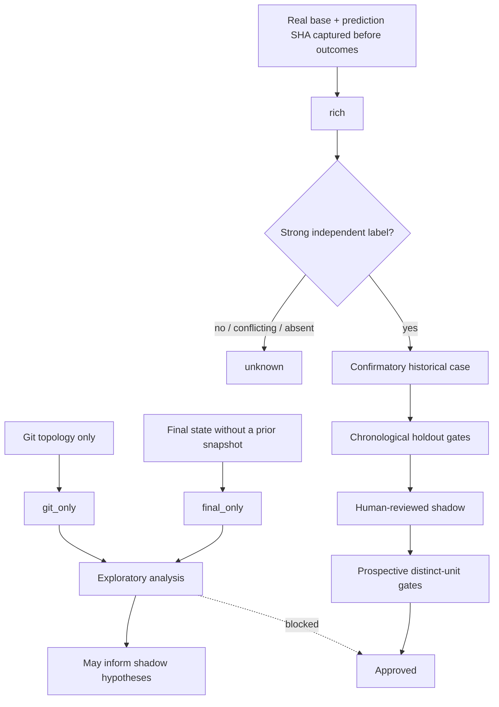

# RuleLoom

**Inductive logic programming for evidence-backed coding-agent policies.**

RuleLoom is an experimental CLI that turns a repository's change history into
small, inspectable Horn rules. It separates deterministic facts available at a
prediction point from outcomes observed later, evaluates learned rules on a
chronological holdout, and requires human review before any rule can reach a
coding agent.

> [!WARNING]
> RuleLoom v0.4.0 is alpha research software. Start in blinded shadow mode. Do
> not use it as a merge gate, security control, or autonomous policy publisher.

The core is language- and provider-neutral. Programming-language knowledge
belongs in optional versioned evidence packs; forge, review, CI, and incident
systems feed one normalized event contract. The learner and lifecycle depend
only on persisted Boolean facts, timestamps, provenance, and stable change IDs.

## Table of contents

- [Why RuleLoom](#why-ruleloom)
- [What it does—and does not do](#what-it-doesand-does-not-do)
- [How it works](#how-it-works)
- [Install](#install)
- [Quick start: bootstrap an existing repository](#quick-start-bootstrap-an-existing-repository)
- [Normalized history JSONL](#normalized-history-jsonl)
- [Evidence grades and promotion gates](#evidence-grades-and-promotion-gates)
- [What RuleLoom can learn](#what-ruleloom-can-learn)
- [Evidence packs and adapters](#evidence-packs-and-adapters)
- [Command reference](#command-reference)
- [Scientific guarantees and threats to validity](#scientific-guarantees-and-threats-to-validity)
- [Data and security](#data-and-security)
- [Development and contributing](#development-and-contributing)
- [Documentation](#documentation)
- [License](#license)

## Why RuleLoom

Repository-specific engineering knowledge often ends up as an unstructured list
of prompt instructions. Those instructions can become stale, conflict with one
another, and rarely retain a link to the changes and outcomes that motivated
them.

RuleLoom tests a narrower, falsifiable idea:

> Can a repository's own point-in-time change facts predict a later, explicitly
> defined outcome well enough to justify a small readable rule?

It addresses four practical gaps:

- **cold start:** use evidence already present in Git and exported development
  systems instead of waiting months before instrumentation begins;
- **leakage control:** group commits into logical changes and reconstruct facts
  at a prediction SHA, before review, CI, revert, or incident outcomes;
- **interpretability:** learn compact Horn clauses rather than opaque policy
  text;
- **governance:** keep candidate, shadow, approved, and deprecated states
  separate and auditable.

The approach is supported—not proven—by research on just-in-time defect
prediction, temporal evaluation, noisy CI and defect labels, and repository
experience. The evidence matrix and limitations are documented in
[docs/RESEARCH.md](docs/RESEARCH.md); the product hypothesis and falsification
criteria are in [docs/THESIS.md](docs/THESIS.md).

## What it does—and does not do

RuleLoom does:

- collect language-neutral Git topology and deterministic change facts;
- import provider-neutral historical events and logical `ChangeUnit` records;
- derive conservative atomic outcomes from later review, CI, revert, and
  incident evidence;
- keep unknown outcomes unknown instead of silently treating absence as a
  negative;
- learn non-recursive unary Horn rules and compare them with simple baselines;
- split evidence chronologically and record the exact train/holdout IDs;
- assess reviewed rules prospectively and render approved rules for Codex or
  Claude Code.

RuleLoom does not:

- prove that a rule causes better software or that an alert prevented a bug;
- verify functional correctness, UI parity, security, or architectural quality;
- replace tests, CI, code review, or human judgment;
- turn Git-only history into confirmatory evidence;
- infer a negative outcome merely because no failure was recorded;
- invent new predicates in v0.4.0;
- implement full relational ILP with joins, recursion, entity variables, or
  unrestricted predicate invention;
- automatically fetch data from every forge or project-management provider.

## How it works

```mermaid
flowchart LR
    G[Git object graph] --> H[Historical events and ChangeUnits]
    P[Forge / review / CI / incident exporter] --> H
    H --> S[Prediction-time snapshot]
    S --> E[Versioned evidence pack]
    E --> F[Boolean facts + provenance]
    H --> O[Delayed atomic outcome]
    F --> I[ILP learner]
    O --> I
    I --> T[Chronological evaluation + baselines]
    T --> C[Immutable candidate]
    C --> R{Human review}
    R -->|accepted for observation| SH[Blinded shadow]
    SH --> PG{Prospective gates}
    PG -->|pass + explicit approval| A[Approved policy]
    A --> X[Codex / Claude adapters]
```



The important boundary is time. For each logical change, facts must be
extractable from `base_sha..prediction_sha`; label evidence must become
available strictly later. A merge or final diff may already contain fixes added
during review and can therefore leak the outcome.

Historical state is stored locally:

```text
.ruleloom/
├── config.json
├── observations.jsonl
├── history/
│   ├── events.jsonl
│   └── change-units.jsonl
├── candidates/
├── shadow/
├── approved/
├── deprecated/
└── predictions.jsonl
```

## Install

Requirements:

- Python 3.11 or newer;
- Git;
- macOS or Linux. v0.4.0 uses POSIX `fcntl` locking and does not support
  Windows.

From a checkout:

```bash
uv tool install .
```

Equivalent local alternatives:

```bash
pipx install .
# or
python -m pip install .
```

Verify the installation inside the target repository:

```bash
ruleloom --version
ruleloom doctor
```

The built-in Horn engine has no runtime Python dependencies. The optional
Popper adapter requires a separately provisioned, pinned Popper checkout,
SWI-Prolog, GNU `timeout`, and a compatible Python runtime. RuleLoom never clones
or installs those dependencies while learning; see
[docs/PILOT-PROTOCOL.md](docs/PILOT-PROTOCOL.md) before enabling it.

## Quick start: bootstrap an existing repository

Run these commands from the repository whose evidence you want to study. It
must have either `remote.origin.url` or at least one commit so RuleLoom can
derive a stable repository identity.

### 1. Initialize a language-neutral experiment

```bash
ruleloom init . --project example-project --pack generic_changes
ruleloom doctor
```

`init` does not install agent guidance by default. Keep that separation during
the first shadow pilot. To study a different atomic outcome, register it at
initialization time—before importing or inspecting labels—and give it an
operational definition:

```bash
ruleloom init . \
  --project defect-experiment \
  --pack generic_changes \
  --target post_merge_defect \
  --outcome-definition "explicitly linked defect after the registered maturity window"
```

That command is an alternative initialization for a clean experiment, not a
second command to run over an existing `.ruleloom/` directory.

### 2. Ingest a bounded prefix of Git history

```bash
ruleloom history bootstrap-git --all
```

This retains the most recent reachable prefix bounded by three safety limits:
100,000 commits, 64 MiB for each canonical history JSONL, and 1 MiB for one
canonical record. Use `--max-commits N`, `--ref REF`, or an aware
`--since TIMESTAMP` for a tighter run. If the next commit would exceed either
storage budget, collection stops before it and reports `storage_truncated=true`,
the exact event/unit byte totals, both limits, and a manifest hash that binds
those values. Re-running the command is idempotent for identical immutable
records.

Git topology is useful on day one, but it is **exploratory**: it cannot prove a
PR-time snapshot or an independent outcome. Shallow, commit-limited, and
storage-limited histories are reported explicitly. Raw Git output has a separate
bounded safety limit and fails closed when unusually large metadata exceeds it.

### 3. Import point-in-time events when available

Export review, CI, change-snapshot, revert, and incident data from any provider
into the normalized JSONL contract, then import it:

```bash
ruleloom history import --events /absolute/path/to/events.jsonl
```

RuleLoom assembles eligible events into logical change units by default. If an
external adapter already produced canonical units, import either or both files:

```bash
ruleloom history import \
  --events /absolute/path/to/events.jsonl \
  --units /absolute/path/to/change-units.jsonl
```

The core does not call a provider API in v0.4.0; the exporter is an adapter at
the boundary. Event imports are append-only. A later outcome event may safely
advance a materialized label from `unknown` to mature, but cannot rewrite a
mature label or the predictor snapshot. See the
[minimal JSONL examples](#normalized-history-jsonl).

Import the structural snapshot/finalization history for each change before its
unit is assembled. If an exporter streams those records in stages, use
`--no-assemble` until the structural set is complete, then run one ordinary
import to assemble it. Once created, a `ChangeUnit` ID cannot be upgraded from
open to finalized or from `final_only` to `rich`; outcome-only events may still
be appended and rematerialized.

### 4. Materialize facts and delayed outcomes

```bash
ruleloom history materialize
ruleloom history status
ruleloom validate
ruleloom readiness
```

`materialize` replays `base_sha..prediction_sha` through the experiment's frozen
evidence pack. The default historical outcome is
`validation_rework_required`; the legacy configured target
`needs_extra_validation` maps to it automatically.

`--outcome-target` may explicitly assert the registered mapping, but cannot
override or reinterpret the frozen target:

```bash
ruleloom history materialize \
  --outcome-target validation_rework_required
```

The four historical targets are deliberately separate:

- `validation_rework_required`;
- `change_attributable_ci_failure`;
- `post_merge_revert_or_hotfix`;
- `post_merge_defect`.

Weak heuristics are excluded by default. `--include-weak` is an explicit
exploratory opt-in and makes dependent cases non-confirmatory.

### 5. Learn and inspect a candidate

Continue only after `readiness` reports both mature classes and enough temporal
train/holdout evidence for the configured gates:

```bash
ruleloom learn --engine horn
ruleloom candidate list
ruleloom candidate show <candidate-id>
```

Learning from `git_commit` and `historical_change` observations cannot be mixed
in one candidate. Historical learning enforces one labeled observation per
stable `change_id`.

### 6. Run a blinded shadow pilot

After human inspection, promote only to shadow for the initial pilot:

```bash
ruleloom promote <candidate-id> \
  --to shadow \
  --reviewer <reviewer> \
  --note "Reviewed for prospective shadow evaluation"
```

An isolated observer—not the coding agent or outcome adjudicator—records
predictions keyed by a stable change unit:

```bash
ruleloom assess \
  --base origin/main \
  --change-id change-123 \
  --include-shadow \
  --blind \
  --json

ruleloom report
```

Reuse the same `--change-id` for repeated snapshots of the same change; never
reuse it for independent changes. The pilot report evaluates the earliest
prediction per change and reports later records as duplicates. `--blind`
redacts stdout but is not an access-control boundary: isolate
`.ruleloom/shadow/` and `.ruleloom/predictions.jsonl` with a separate account,
ACL, or CI job.

Approval and `sync-agents` belong to a later, separately reviewed rollout after
prospective gates pass. The complete runbook is in
[docs/PILOT-PROTOCOL.md](docs/PILOT-PROTOCOL.md).

## Normalized history JSONL

Each line is one strict JSON object under the public v1 schema. IDs use lowercase
letters, digits, `.`, `_`, or `-`; timestamps require an explicit timezone; Git
object IDs must be lowercase 40- or 64-character hashes. Replace the example
repository ID and hashes with values from the initialized repository that
actually exist in its object database.

### Minimal event stream

The first line captures a genuine prediction-time snapshot. The later,
independent review supplies a strong positive vote for
`validation_rework_required`:

```jsonl
{"schema_version":1,"id":"evt.change-42.snapshot-1","repository_id":"repo.0123456789abcdef0123","kind":"change_snapshot","occurred_at":"2026-01-10T12:00:00Z","available_at":"2026-01-10T12:00:00Z","provider":"example_forge","source_ref":"changes/42/snapshots/1","change_id":"change-42","independent_group":"change-42","data":{"base_sha":"1111111111111111111111111111111111111111","head_sha":"2222222222222222222222222222222222222222","point_in_time":true,"commits":["2222222222222222222222222222222222222222"]}}
{"schema_version":1,"id":"evt.change-42.review-1","repository_id":"repo.0123456789abcdef0123","kind":"review","occurred_at":"2026-01-11T09:30:00Z","available_at":"2026-01-11T09:31:00Z","provider":"example_forge","source_ref":"changes/42/reviews/1","change_id":"change-42","independent_group":"reviewer-7","data":{"decision":"changes_requested","category":"validation","independent":true}}
```

This example is schema-valid but not directly runnable until its repository ID
and Git hashes are replaced. Obtain the configured repository identity with:

```bash
python -c 'import json; print(json.load(open(".ruleloom/config.json"))["protocol"]["repository_id"])'
```

### Minimal explicit change unit

An adapter may provide a canonical unit alongside its referenced event stream:

```jsonl
{"schema_version":1,"id":"change-42","repository_id":"repo.0123456789abcdef0123","kind":"provider_change","base_sha":"1111111111111111111111111111111111111111","prediction_sha":"2222222222222222222222222222222222222222","prediction_at":"2026-01-10T12:00:00Z","final_sha":null,"finalized_at":null,"commits":["2222222222222222222222222222222222222222"],"event_ids":["evt.change-42.snapshot-1"],"provider":"example_forge","source_ref":"changes/42/snapshots/1","evidence_quality":"rich","confirmatory":true}
```

This unit is not standalone: import it together with the event JSONL above, or
import the events first with `--no-assemble` and then import the unit.

Import is strict and fail-closed: unknown fields, duplicate IDs, conflicting
immutable records, symlinked input files, invalid timestamps, or mismatched
repository identities are rejected. Every `ChangeUnit.event_ids` reference must
exist in the same repository and either name that logical change or be an
explicitly attached unscoped event (`change_id: null`). Full field semantics and
limits are in
[docs/DATA-SCHEMA.md](docs/DATA-SCHEMA.md).

## Evidence grades and promotion gates



| Grade | What is known | Intended use | Approval |
| --- | --- | --- | --- |
| `git_only` | Commit topology and metadata | Cold-start exploration | Blocked as historical support |
| `final_only` | Final state, no trustworthy prior snapshot | Exploration; leakage warning | Blocked as historical support |
| `rich` | Real prediction snapshot plus linked events | Historical evaluation | Only if the case remains confirmatory |

Strong evidence includes an independent validation-related change request, an
attributable CI fail–code-change–same-check-pass sequence, an explicitly linked
revert/incident, or an explicit matured outcome with complete evidence. Test
changes alone, fix keywords, and SZZ links are weak. Missing, immature, or
conflicting evidence produces `unknown`, never an inferred negative.

The CI sequence must be strictly ordered. Its failure and success events must
use the same provider and stable provider-scoped check identity; the intervening
code-change event may come from the forge. Tied timestamps or CI events stitched
across providers abstain.

Default readiness stages use 20 mature positive outcomes before shadow and 50
before preliminary approval evaluation. Approval also requires attributable
prospective evidence across distinct change IDs, both classes, elapsed time,
per-clause support, and configured precision/recall/MCC gates. These are
configurable operating thresholds—not universal statistical guarantees—and
cannot repair biased sampling or incorrect labels.

## What RuleLoom can learn

The built-in learner searches for small rules over the predicates declared by
one frozen pack. A possible output might be:

```prolog
needs_extra_validation(A) :- touches_ci(A), not_touches_test(A).
```

Read it as: “for changes that touch CI configuration and do not touch tests,
predict the configured outcome.” It is a predictive association local to one
experiment—not a universal best practice or a causal claim.

RuleLoom can combine:

- generic facts such as `large_change`, `multi_file_change`, `touches_ci`,
  `touches_dependencies`, `touches_docs`, and `touches_test`;
- repository-defined path concepts such as `touches_public_api` or
  `touches_shared_contract`;
- deterministic predicates from a specialized, versioned pack.

It cannot learn a predicate that was never declared and extracted. New concepts
enter through a reviewed evidence-pack or configured-path experiment, receive a
new protocol hash, and require a new untouched future confirmation window. An
LLM may propose candidate concepts, but deterministic code must extract them and
a human must approve the vocabulary before labels or holdout results are
inspected.

## Evidence packs and adapters

Run the registry command to inspect the packs available in the installed
version:

```bash
ruleloom packs list
ruleloom packs list --json
```

The default `generic_changes@1` reads change shape and well-known path roles; it
does not parse programming-language syntax. `configured_paths@1` adds a frozen,
repository-specific component vocabulary while remaining language-neutral:

```bash
ruleloom init . \
  --project component-experiment \
  --pack configured_paths \
  --pack-version 1 \
  --path-predicate 'touches_public_api=interfaces/public/**' \
  --path-predicate 'touches_shared_contract=contracts/**' \
  --path-exclude 'touches_shared_contract=contracts/generated/**'
```

Evidence scope (`include_paths`/`exclude_paths`), large-change thresholds,
predicate configuration, pack name, and pack version are bound into the
evidence protocol hash. Freeze them before inspecting labels, candidate rules,
or holdout errors.

Adapters have two independent roles:

1. **Evidence adapters** normalize a provider's change, review, CI, revert, and
   incident records into historical-event JSONL. v0.4.0 ships the contract and
   importer, not hosted provider integrations.
2. **Agent adapters** render only approved policies into
   `.agents/skills/ruleloom/SKILL.md` for Codex and
   `.claude/skills/ruleloom/SKILL.md` for Claude Code.

The canonical policy remains provider-neutral. Generated agent files are
derived artifacts and should be reviewed like source code.

## Command reference

| Command | Purpose |
| --- | --- |
| `ruleloom init` | Initialize one frozen experiment and local data layout |
| `ruleloom packs list` | Inspect registered evidence packs and predicates |
| `ruleloom history bootstrap-git` | Ingest bounded Git topology as exploratory history |
| `ruleloom history import` | Import normalized events and/or change units |
| `ruleloom history materialize` | Reconstruct prediction-time facts and conservative labels |
| `ruleloom history status` | Summarize grades, confirmatory units, and labels |
| `ruleloom collect git` | Collect curated retrospective or prospective Git facts |
| `ruleloom label` / `import-labels` | Attach outcomes to non-derived observations; historical changes use events |
| `ruleloom validate` | Validate schemas, identity, provenance, and temporal invariants |
| `ruleloom readiness` | Report sample stage, classes, unknowns, and evidence coverage |
| `ruleloom learn` | Learn and chronologically evaluate a candidate |
| `ruleloom candidate list/show` | Inspect immutable candidate artifacts |
| `ruleloom promote` | Record a reviewed transition to shadow or approved |
| `ruleloom assess` | Evaluate reviewed policies on a stable prospective change ID |
| `ruleloom report` | Report leakage-aware prospective association metrics |
| `ruleloom sync-agents` | Render approved policies for selected coding agents |
| `ruleloom deprecate` | Tombstone an active policy with review provenance |
| `ruleloom trust` | Attest a reviewed artifact in the current checkout/worktree |
| `ruleloom doctor` | Check Git/Python and optional learner prerequisites |

Use `ruleloom <command> --help` for complete options. Most commands discover the
initialized root from the current directory; `--root /path/to/repository`
selects it explicitly.

## Scientific guarantees and threats to validity

RuleLoom enforces several useful invariants:

- strict versioned JSON/JSONL contracts and immutable historical record IDs;
- deterministic fact provenance and content-addressed candidate artifacts;
- a prediction timestamp before every usable label-availability timestamp;
- one stable logical change ID per historical training example;
- chronological train/holdout evaluation with label-availability filtering;
- comparison against `never_alert`, `always_alert`, training-majority, and the
  best training-selected single literal;
- explicit abstention and human-reviewed lifecycle transitions;
- approval blocking for non-confirmatory historical evidence.

Those controls do not eliminate:

- selection bias in which repositories, changes, reviews, or incidents were
  retained;
- concept drift after workflows, architecture, or review practices change;
- correlated or duplicated outcomes outside the available change grouping;
- mislabeled CI failures, issue links, reverts, or human judgments;
- adaptive overfitting if predicates or thresholds are changed after seeing a
  holdout;
- causal ambiguity: prediction quality does not establish intervention value;
- local tampering by a process with the same OS-user access.

The design therefore treats retrospective learning as candidate generation and
requires a blinded prospective shadow period. A later controlled rollout is
needed to measure whether visible guidance changes outcomes. See the
[research basis](docs/RESEARCH.md) and
[pilot protocol](docs/PILOT-PROTOCOL.md) for the pre-registration checklist and
reporting requirements.

## Data and security

RuleLoom operates locally by default, but `.ruleloom/` can contain filenames,
commit metadata, component taxonomies, evidence excerpts, labels, and reviewer
notes. Paths alone may disclose sensitive system structure.

- Do not ingest secrets or full source when paths, bounded excerpts, or hashes
  suffice.
- Decide explicitly which `.ruleloom/` artifacts belong in version control.
- Keep shadow candidates and predictions inaccessible to the coding agent and
  outcome adjudicator during a blinded pilot.
- Treat imported event text, rule explanations, and generated skills as
  untrusted repository data.
- Do not upload evidence without repository-owner authorization.

Reviewed artifacts copied through Git are not locally trusted automatically.
`ruleloom trust` records a checkout-specific attestation after inspection. This
detects ordinary copying and accidental tampering; it is not a security boundary
against a malicious same-user process. Report vulnerabilities according to
[SECURITY.md](SECURITY.md).

## Development and contributing

```bash
git clone https://github.com/gusmondel/RuleLoom.git
cd RuleLoom
uv sync
uv run ruleloom --help
make check
```

`make check` runs formatting checks, Ruff, strict mypy, the test suite with its
coverage gate, and package build. Contributions should preserve the
language/provider boundary, add deterministic provenance for new facts, include
tests, and update versioned schemas or protocol documentation when contracts
change.

Read [CONTRIBUTING.md](CONTRIBUTING.md) and
[CODE_OF_CONDUCT.md](CODE_OF_CONDUCT.md) before opening a change.

## Documentation

- [Product thesis and falsification criteria](docs/THESIS.md)
- [Research evidence matrix](docs/RESEARCH.md)
- [Shadow-pilot protocol](docs/PILOT-PROTOCOL.md)
- [Versioned data schema](docs/DATA-SCHEMA.md)
- [Security policy](SECURITY.md)

## License

Apache License 2.0. See [LICENSE](LICENSE) and [NOTICE](NOTICE).
