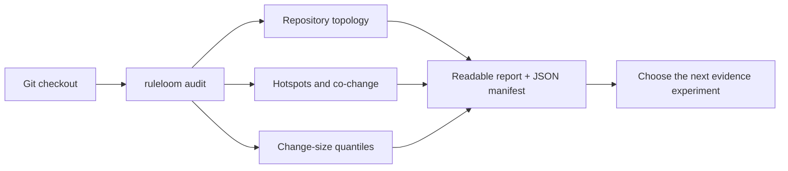
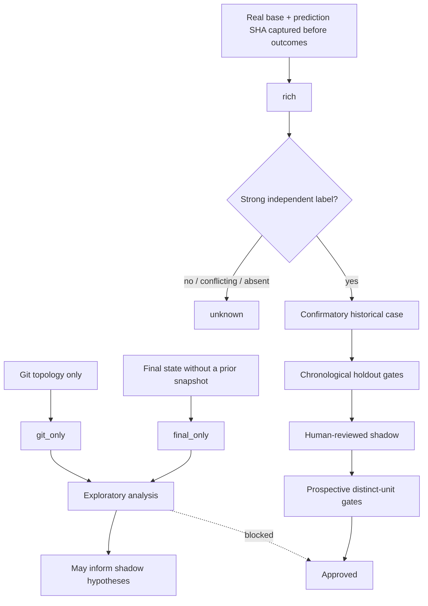
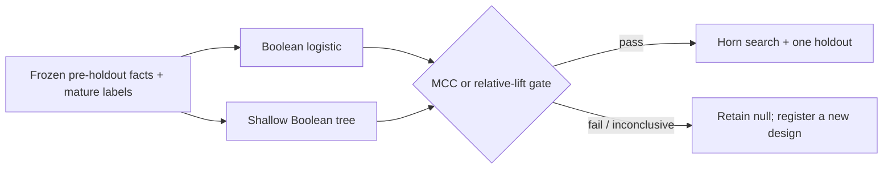

# RuleLoom

**Evidence-backed guardrails for coding agents, learned from repository history.**

[](https://github.com/gusmondel/RuleLoom/actions/workflows/ci.yml)
[](https://github.com/gusmondel/RuleLoom/blob/main/LICENSE)

RuleLoom is a local-first, experimental CLI that turns repository history into
small, inspectable Horn rules. It can also audit repository structure and
explicit engineering conventions before any labels exist. Every predictive
claim keeps its point-in-time facts, later outcomes, chronological evaluation,
and review state attached as evidence.

> [!WARNING]
> RuleLoom v0.10.0 is alpha research software. Start in blinded shadow mode. Do
> not use it as a merge gate, security control, or autonomous policy publisher.

The core is language- and provider-neutral. Programming-language knowledge
belongs in optional versioned evidence packs; forge, review, CI, and incident
systems feed one normalized event contract. The learner and lifecycle depend
only on persisted Boolean facts, timestamps, provenance, and stable change IDs.

## Table of contents

- [Why RuleLoom](#why-ruleloom)
- [Public evidence](#public-evidence)
- [First-five-minute structural audit](#first-five-minute-structural-audit)
- [What it does—and does not do](#what-it-doesand-does-not-do)
- [How it works](#how-it-works)
- [Install](#install)
- [Quick start: bootstrap an existing repository](#quick-start-bootstrap-an-existing-repository)
- [Decision-time MCP integration](#decision-time-mcp-integration)
- [Normalized history JSONL](#normalized-history-jsonl)
- [Evidence grades and promotion gates](#evidence-grades-and-promotion-gates)
- [Signal-first learning](#signal-first-learning)
- [What RuleLoom can learn](#what-ruleloom-can-learn)
- [Evidence packs and adapters](#evidence-packs-and-adapters)
- [Command reference](#command-reference)
- [Scientific guarantees and threats to validity](#scientific-guarantees-and-threats-to-validity)
- [Data and security](#data-and-security)
- [Development and contributing](#development-and-contributing)
- [Documentation](#documentation)
- [License](#license)

## Why RuleLoom

Repository-specific engineering knowledge often ends up as an unstructured list
of prompt instructions. Those instructions can become stale, conflict with one
another, and rarely retain a link to the changes and outcomes that motivated
them.

RuleLoom tests a narrower, falsifiable idea:

> Can a repository's own point-in-time change facts predict a later, explicitly
> defined outcome well enough to justify a small readable rule?

It addresses four practical gaps:

- **cold start:** use evidence already present in Git and exported development
  systems instead of waiting months before instrumentation begins;
- **leakage control:** group commits into logical changes and reconstruct facts
  at a prediction SHA, before review, CI, revert, or incident outcomes;
- **interpretability:** learn compact Horn clauses rather than opaque policy
  text;
- **governance:** keep candidate, shadow, approved, and deprecated states
  separate and auditable.

The intended owner is a Platform, DevEx, or agent-infrastructure team that needs
repository-specific guidance with local evidence processing rather than a
required hosted RuleLoom service.
The differentiator is not merely generating a rule; it is being able to answer
“why did this guidance appear, what evidence supported it, and is it still
holding?”

## Public evidence

The first preregistered public evaluation is a deliberately visible null result.
On 6,314 Apache Airflow pull requests, 3,674 opening snapshots were safely
materialized. The Horn learner found no qualifying rule and scored holdout MCC
`0.000`; a supplementary Boolean logistic baseline scored `0.136`, still with
only `0.159` precision. An exact hourly source audit found 42 missing GH Archive
hours and conservatively reclassified every negative whose evidence interval
crossed a gap. The frozen success criterion failed and no policy was
promoted.

That result is useful: it demonstrates that the ingestion and temporal
evaluation path can run at repository scale while showing that coarse path
predicates are insufficient for this review target. It also exposes a
statistically detectable materialization-retention difference between positive
and negative units. Read the protocol, cohort flow, exact hashes, metrics, and
limitations in the
[Apache Airflow case study](case-studies/apache-airflow/README.md).

A separate v0.9 smoke test ran the same language-neutral cold-start pipeline on
500 commits each from Flask, ripgrep, and Express. It retained `99.2–100%` of
the selected units and produced different prior-history feature distributions,
but correctly stopped as inconclusive because Git alone supplied no mature
labels. See the pinned revisions, timings, predicate prevalences, and
partial-clone safeguard in the
[portability result](case-studies/portability-v09/RESULTS.md).

## First-five-minute structural audit

From any Git checkout, before initialization or labels:

```bash
ruleloom audit .
```

The command is read-only and outcome-blind. It reports change-size quantiles,
frequently changed paths, bounded co-change pairs, coverage, truncation, and the
limits of the evidence. It does **not** call co-change a dependency or estimate
defect risk. Use `--json` for automation. Lower `--diff-batch-size` to reduce
RuleLoom's aggregate subprocess output when several commits are large; it cannot
split the numstat of one megachange.



That is immediate structural evidence. Whether teams find it actionable remains
an adoption hypothesis with an explicit usability gate. Predictive value is a
separate, higher evidence level and requires later outcomes.

The approach is supported—not proven—by research on just-in-time defect
prediction, temporal evaluation, noisy CI and defect labels, and repository
experience. The evidence matrix and limitations are documented in
[docs/RESEARCH.md](https://github.com/gusmondel/RuleLoom/blob/main/docs/RESEARCH.md);
the product hypothesis and falsification criteria are in
[docs/THESIS.md](https://github.com/gusmondel/RuleLoom/blob/main/docs/THESIS.md).

## What it does—and does not do

RuleLoom does:

- collect language-neutral Git topology and deterministic change facts;
- produce a zero-configuration, read-only structural audit;
- import provider-neutral historical events and logical `ChangeUnit` records;
- collect a bounded GitHub PR/review/check/revert archive through the authenticated
  `gh` CLI;
- derive conservative atomic outcomes from later review, CI, revert, and
  incident evidence;
- freeze explicit, hand-authored Horn risk rules and audit their historical
  coverage before a prospective shadow pilot;
- bind explicit repository conventions to hashed source spans and audit their
  structural adherence without interpreting prose;
- keep unknown outcomes unknown instead of silently treating absence as a
  negative;
- learn non-recursive unary Horn rules and compare them with simple baselines;
- search that space with a beam over every eligible predicate, gate clauses on
  Wilson lower-bound precision and cross-half temporal consistency, prune them
  on a chronological window, and calibrate the best train statistic against a
  label-permutation null;
- derive weak, opt-in exploratory labels from Git alone: exact `git revert`
  trailers and a registered revert window whose observability is proven by a
  recorded history horizon;
- propose an outcome-blind instantiated vocabulary (hotspots, owner areas,
  missing co-change partners) plus assertion drafts for human review before a
  new experiment is frozen;
- probe pre-holdout signal with rolling-origin logistic and shallow-tree models
  before allowing the learner to spend the frozen holdout;
- report train-only near-miss clauses and relative-to-base-rate diagnostics when
  no rule clears the frozen gates;
- split evidence chronologically and record the exact train/holdout IDs;
- assess reviewed rules prospectively, expose approved-only guidance through a
  local stdio MCP server, and render approved rules for supported agents.

RuleLoom does not:

- prove that a rule causes better software or that an alert prevented a bug;
- verify functional correctness, UI parity, security, or architectural quality;
- replace tests, CI, code review, or human judgment;
- turn Git-only history into confirmatory evidence;
- infer a negative outcome merely because no failure was recorded;
- interpret `AGENTS.md`, `CLAUDE.md`, issue text, review prose, or ordinary
  GitHub labels as rules or outcomes;
- activate a proposed predicate without human review and a new frozen
  experiment;
- pool training evidence across repositories automatically;
- implement full relational ILP with joins, recursion, entity variables, or
  unrestricted predicate invention;
- automatically fetch data from every forge or project-management provider.

## How it works

```mermaid
flowchart LR
    G[Git object graph] --> D[Day-one structural audit]
    G --> H[Historical events and ChangeUnits]
    P[Forge / review / CI / incident exporter] --> H
    H --> S[Prediction-time snapshot]
    S --> E[Versioned evidence pack]
    E --> F[Boolean facts + provenance]
    H --> O[Delayed atomic outcome]
    F --> I[ILP learner]
    O --> I
    F --> P[Pre-holdout signal probe]
    O --> P
    P -->|pass| I
    P -->|fail or inconclusive| Z[Protect holdout and redesign]
    I --> T[One chronological holdout + baselines]
    T --> C[Immutable candidate]
    M[Reviewed manual Horn manifest] --> C
    C --> R{Human review}
    R -->|accepted for observation| SH[Blinded shadow]
    SH --> PG{Prospective gates}
    PG -->|pass + explicit approval| A[Approved policy]
    A --> X[Agent adapters]
    A --> MCP[Local approved-only MCP]
```



The important boundary is time. For each logical change, facts must be
extractable from `base_sha..prediction_sha`; label evidence must become
available strictly later. A merge or final diff may already contain fixes added
during review and can therefore leak the outcome.

Historical state is stored locally:

```text
.ruleloom/
├── config.json
├── observations.jsonl
├── history/
│   ├── events.jsonl
│   └── change-units.jsonl
├── candidates/
├── shadow/
├── approved/
├── deprecated/
└── predictions.jsonl
```

## Install

Requirements:

- Python 3.11 or newer;
- Git;
- the authenticated GitHub CLI (`gh`) only when using
  `history import-github`;
- macOS or Linux. v0.10.0 uses POSIX `fcntl` locking and does not support
  Windows.

From a checkout:

```bash
git clone https://github.com/gusmondel/RuleLoom.git
cd RuleLoom
uv tool install .
```

Equivalent local alternatives:

```bash
pipx install .
# or
python -m pip install .
```

Verify that the executable is installed. `doctor` additionally requires an
initialized RuleLoom project, so run it after step 1 below:

```bash
ruleloom --version
ruleloom audit /path/to/repository
```

For local MCP serving, choose the optional official SDK integration instead of
the core-only install command:

```bash
uv tool install '.[mcp]'
```

The repository does not claim a PyPI release until a versioned/tagged release has
actually been published. Release automation is prepared for PyPI Trusted
Publishing; see
[docs/RELEASING.md](https://github.com/gusmondel/RuleLoom/blob/main/docs/RELEASING.md).

The built-in Horn engine has no runtime Python dependencies. The optional
Popper adapter requires a separately provisioned, pinned Popper checkout,
SWI-Prolog, GNU `timeout`, and a compatible Python runtime. RuleLoom never clones
or installs those dependencies while learning; see
[docs/PILOT-PROTOCOL.md](https://github.com/gusmondel/RuleLoom/blob/main/docs/PILOT-PROTOCOL.md)
before enabling it.

## Quick start: bootstrap an existing repository

Run these commands from the repository whose evidence you want to study. It
must have either `remote.origin.url` or at least one commit so RuleLoom can
derive a stable repository identity.

### 0. Audit without creating state

```bash
ruleloom audit .
ruleloom audit . --json > ruleloom-structure-audit.json
```

The audit does not create `.ruleloom/`, read outcomes, infer a programming
language, or require a forge account. Decide whether the structural findings
are useful before starting an evidence experiment.

At any point after initialization, run:

```bash
ruleloom diagnose
```

It summarizes the current evidence stage, positive-count and class-readiness
gaps, vocabulary diagnostics, and the next safe commands. It does not evaluate
the temporal split, holdout metrics, or prospective promotion gates. It is
read-only: it does not collect data, reinterpret labels, or relax a promotion
gate. Use `--json` in scripts.

### 1. Initialize a language-neutral experiment

```bash
ruleloom init . --project example-project --pack generic_changes
ruleloom doctor
```

`init` does not install agent guidance by default. Keep that separation during
the first shadow pilot. To study a different atomic outcome, register it at
initialization time—before importing or inspecting labels—and give it an
operational definition:

```bash
ruleloom init . \
  --project defect-experiment \
  --pack generic_changes \
  --target post_merge_defect \
  --outcome-definition "explicitly linked defect after the registered maturity window"
```

That command is an alternative initialization for a clean experiment, not a
second command to run over an existing `.ruleloom/` directory.

Two optional registrations belong to the same frozen moment. `--git-window-days
N` registers a revert window for `post_merge_revert_or_hotfix`: a landed change
with no revert trailer before the window closes, inside history the recorded
horizon proves complete, becomes an opt-in *weak* negative. `--pack-config
FILE` freezes a reviewed `generic_changes@3` vocabulary, typically the output of
`ruleloom predicates propose` described in step 3:

```bash
ruleloom init . \
  --project revert-experiment \
  --target post_merge_revert_or_hotfix \
  --git-window-days 30 \
  --pack-config reviewed-pack-config.json
```

Both values are bound into the evidence protocol hash. Weak labels never make a
unit confirmatory, so a Git-only cohort can feed the signal probe and the
learner but cannot approve a policy.

### 2. Ingest a bounded prefix of Git history

```bash
ruleloom history bootstrap-git --all
```

This retains the most recent reachable prefix bounded by three safety limits:
100,000 commits, 64 MiB for each canonical history JSONL, and 1 MiB for one
canonical record. Use `--max-commits N`, `--ref REF`, or an aware
`--since TIMESTAMP` for a tighter run. If the next commit would exceed either
storage budget, collection stops before it and reports `storage_truncated=true`,
the exact event/unit byte totals, both limits, and a manifest hash that binds
those values. Re-running the command is idempotent for identical immutable
records.

Git topology is available on day one, but it is **exploratory**: it cannot prove a
PR-time snapshot or an independent outcome. Shallow, commit-limited, and
storage-limited histories are reported explicitly. Raw Git output has a separate
bounded safety limit and fails closed when unusually large metadata exceeds it.

The bootstrap also records two Git-native outcome signals without reading prose
as instructions. Every exact `This reverts commit <sha>` trailer that `git
revert` generates becomes a weak `revert` event linked to the reverted change
(`link_kind: git_trailer`), and one `git_history_horizon` event stores the
newest committer timestamp of the retained prefix. The report shows
`revert_events` and `horizon_at`. Reverts on branches unreachable from the
selected ref and fix-forward hotfixes without a revert remain invisible; that is
why these votes stay weak.

For later observer runs, keep the exact `resolved_ref` from a successfully
persisted Git bootstrap and collect only its descendants:

```bash
ruleloom history bootstrap-git --after <previous-resolved-ref>
```

The boundary must already exist as a Git commit or merge `source_ref` in this
repository's canonical ledger and must still be an ancestor of the selected
ref. A cursor from an empty, foreign, or different ledger is rejected before
collection. Force-pushed, rewritten, or divergent history is rejected instead
of silently combined. Incremental collection from a shallow clone is also
rejected: fetch the complete history before advancing a cursor. A shallow
bootstrap without `--after` remains available only as explicitly incomplete,
exploratory evidence.

An incremental interval must be complete. If `--max-commits`, the hard commit
cap, or canonical storage budgets would truncate the range, the command fails
without persisting it and its `resolved_ref` must not be used as the next
cursor. `--after` and `--since` are mutually exclusive because commit timestamps
are not a safe contiguous cursor. Advance the saved cursor only after a
successful, non-truncated collection. Git traversal is then bounded to new
commits, but the v1 JSONL upsert still validates and rewrites the retained
ledger. See
[Git history performance and storage](https://github.com/gusmondel/RuleLoom/blob/main/docs/PERFORMANCE.md).

### 3. Audit the frozen vocabulary before opening outcomes

Materialize the Git-only units and inspect predicate behavior before exporting,
opening, or importing review, CI, revert, or incident outcomes:

```bash
ruleloom history materialize
ruleloom predicates audit
```

`predicates audit` is outcome-blind: it reports whole-sample prevalence,
early/late chronological windows, configured-path match counts and bounded path
examples, constant/rare/saturated predicates, observed equivalence,
complementarity, implication and high overlap, and prevalence drift. It does not
rank predicates by their relationship to the target. In particular, prevalence
near 50% is neither evidence of usefulness nor evidence of irrelevance; only
training outcomes can establish predictive discrimination, followed by an
untouched chronological holdout.

The default diagnostic thresholds are 1% for rare, 99% for saturated, 20
percentage points of absolute early/late prevalence shift for drift, and 0.90
Jaccard similarity for high overlap. Override them with
`--rare-threshold`, `--saturated-threshold`, `--drift-threshold`, and
`--overlap-threshold`, and preserve the values with the audit artifact.
Relations need at least two supporting observations. To suppress trivial subset
relations from sparse facts, a one-way implication additionally requires an
antecedent count of `max(2, ceil(rare_threshold * observations))`; the report
records the resulting effective minimum.

The JSON also binds the repository, experiment, target, complete configuration,
evidence protocol, and an outcome-blind observation manifest. Its final audit
manifest hashes that complete payload before the hash field itself is appended,
so reports from different scopes, thresholds, or input facts cannot be confused.

Use this audit to find mechanical vocabulary problems such as a glob that never
matches, an always-true concept, two empirically duplicate concepts, or a path
layout change reflected in temporal drift. Every semantic change to a predicate,
glob, evidence scope, change-shape threshold, extractor, or target starts a new
experiment and protocol hash. Preserve the old attempt, initialize the revised
vocabulary separately, rematerialize, and repeat the outcome-blind audit. Do not
reinterpret existing observations under the new meaning.

Coarse Booleans cap what any learner can find: if thousands of changes share
the same sixteen facts, no conjunction can beat the base rate of its equivalence
class. `ruleloom predicates propose` therefore drafts an *instantiated*
vocabulary from Git structure only, bounded to commits before the frozen
holdout when a project exists:

```bash
ruleloom predicates propose . \
  --pack-config-output proposed-pack-config.json \
  --assertions-output proposed-assertions.json \
  --evidence-path docs/ruleloom/cochange-evidence.md
```

It emits exact-path hotspot predicates, `CODEOWNERS` owner-area predicates
(globs only; owner identities are hashed and never stored; a catch-all rule
covering nearly every commit is skipped as uninformative), `missing_partner_*`
predicates for strong directional co-change pairs that were actually violated
at least twice, and an assertion manifest that translates each pair into
`antecedent → expectation` form, including pairs that were never violated. At
most two pairs share one antecedent path, so a family of generated files cannot
fill the draft. `--evidence-path` writes a reviewable Markdown document into
the checkout that lists every drafted pair with its counts; each assertion cites
the line describing it, so `assertions declare` can hash a small human-reviewed
span instead of a multi-megabyte generated antecedent. Review the draft, delete
anything that is not a real repository concept, then freeze it with `ruleloom
init --pack-config` in a fresh experiment and declare the assertions with
`ruleloom assertions declare`. Proposal is deterministic and outcome-blind;
activation is always a human decision. An LLM may still suggest concepts, but
they enter through the same reviewed `pack_config`, never through the learner.
On a blobless partial clone such as a `--filter=blob:none` observer, pass
`--paths-only`: changed paths are read from trees alone, no lazy blob fetch is
triggered, and churn is simply unavailable to the proposal.

If an existing convention can already be expressed using the frozen predicate
vocabulary, encode it explicitly rather than asking RuleLoom to parse prose.
For example, copy `examples/repository-assertions.json` into the target
repository, then edit its predicates and `sources` span so it cites the real
file that declares the convention:

```bash
ruleloom assertions --root . declare examples/repository-assertions.json
ruleloom assertions --root . audit
```

The declaration hashes its source span and binds the vocabulary and evidence
protocol. The audit reports structural adherence and exceptions only; it does
not claim that adherence prevented failures.

### 4. Import provider evidence when available

For new GitHub activity, the point-in-time capture integration is the preferred
evidence path. The included Action reads the trusted `GITHUB_EVENT_PATH` before
any checkout or repository code runs, normalizes an allow-list of structured
fields, and writes a MAC-protected immutable bundle to operator-controlled
storage. The Action does not make network calls and does not claim that an
Actions event file carries a provider webhook signature.

After durable bundles are copied to an observer inbox, ingest them atomically:

```bash
export RULELOOM_GITHUB_ENVELOPE_KEY='<at-least-16-byte-secret>'
export RULELOOM_FROZEN_LABEL_POLICY_HASH='reviewed-64-hex-policy-pin'
ruleloom history ingest-github-captures /absolute/path/to/inbox \
  --envelope-key-env RULELOOM_GITHUB_ENVELOPE_KEY \
  --expected-label-policy-hash "$RULELOOM_FROZEN_LABEL_POLICY_HASH"
```

Every bundle is verified before one history transaction begins. A corrupt
bundle, symlink, cross-repository record, conflicting replay, or archive upgrade
rejects the complete inbox; files are never deleted or moved. Exact setup,
trust boundaries, label-policy requirements, and the pinning placeholder are in
[the GitHub capture guide](https://github.com/gusmondel/RuleLoom/blob/main/docs/integrations/GITHUB-CAPTURE.md).
Capturing events
is not yet the same as demonstrating automatic label supply: that claim remains
gated on coverage and audited precision.

For a public GitHub repository, authenticate the official CLI and collect a
bounded archive:

```bash
gh auth status --hostname github.com
ruleloom history import-github --repository OWNER/NAME
```

The CLI verifies `OWNER/NAME` against an unambiguous public-GitHub HTTPS, SSH,
or SCP-style `remote.origin.url`. A reviewed mirror or checkout whose origin
cannot establish that equality requires the explicit
`--allow-unverified-repository` override;
the report records `repository_binding` and the manifest hash binds that choice.
The archive adapter does not support a GitHub Enterprise host in v0.10.0.

`--since` filters PRs by `created_at` and also bounds the repository-commit scan.
`--until` is an inclusive as-of cutoff for PR creation and finalization and for
review, check, and revert events; a PR finalized after that
cutoff is skipped rather than assembled from future state. When omitted,
`--until` defaults to the collection time; it does not reconstruct a historical
provider snapshot. It filters only the current collection and never rewinds
records already present in the append-only ledger; use a clean experiment/log
when evaluating an earlier cutoff. Use those options and the `--max-*` options
to bound the request. In addition to per-endpoint
pagination, the default global budgets are 20,000 API requests and 250,000
top-level provider records. Reaching either global budget fails closed before
persistence. Preserve the exact command, JSON report, and resulting canonical
history logs: the report exposes configured global limits, actual usage,
`repository_binding`, a compact `manifest`, and `manifest_hash`. The emitted
manifest binds every per-endpoint/global limit, actual budget use, warning and
count plus content hashes for the exact normalized event and unit sets; verify
it with the canonical logs instead of duplicating those records in stdout. The
adapter requests closed PRs only and skips any unexpectedly non-closed or
force-pushed PR it cannot reconstruct safely. It normalizes reviews and checks
without reading their prose, and records exact Git revert trailers only as weak
heuristic links. Review records are deliberately state-neutral so a later
dismissal cannot rewrite a prior submission; check records are versioned by PR
and normalized check content so a provider update appends a new event instead
of mutating an old one. User and check identities are repository-scoped and
pseudonymized; stable PR and event numbers remain for provenance. Titles,
bodies, reviewer names, review text, and check names are not persisted.

The first built-in GitHub numeric repository identity recorded for one RuleLoom
`repository_id` is pinned by the paired history-log validator. Importing records
from a different provider repository under that same identity fails closed;
start a new experiment instead.

This is an **archive bootstrap**, not a reconstruction of the patch that was
visible when each PR opened. Every GitHub archive `ChangeUnit` is therefore
`git_only`, exploratory, and non-confirmatory. Reviews have an unspecified
category and checks remain unattributed unless stronger point-in-time evidence is
available. The adapter never treats an ordinary review, CI status, or absence
of an event as a strong label. A failed check on the recorded merge result and
an exact Git revert trailer are only weak positive votes for their respective
atomic targets when `--include-weak` is explicitly enabled.

The GitHub adapter collects provider metadata; it does not fetch missing Git
objects into the local checkout. Before materialization, make the recorded
`base_sha` and `prediction_sha` objects available locally—for example by using a
sufficiently complete observer clone or an explicitly reviewed fetch policy.
`history materialize` reports unavailable units under `skipped` and
`skipped_preview`; inspect those fields before interpreting coverage.

Archived GitHub timeline label names are ignored as outcome evidence. GitHub
timeline responses expose the label object as it exists when queried; a later
rename can therefore make an ordinary historical application appear to have had
a different name at the original timestamp. Syntax, actor checks, and an
`--until` cutoff cannot repair that temporal ambiguity.

A label-backed assertion may be strong only when a separate webhook, exporter,
or append-only adjudication ledger captured the label application point-in-time
and can emit a normalized immutable outcome event with its original timestamp,
target, value, evidence completeness, and independent provenance. Import that
event through `ruleloom history import`; retain and audit the external source.
RuleLoom v0.10.0 ships the local point-in-time Action/webhook capture substrate
described above. The archive adapter itself still produces no strong outcome
from label names and cannot upgrade an existing exploratory `git_only` unit;
start a clean experiment for point-in-time capture of that change.

For reproducible research on a public GitHub repository, v0.8 also includes a
strict GH Archive projection. The standalone exporter queries only opened,
merged, approved, and changes-requested event fields, hashes actor identities
before download, audits every expected source hour, and binds the result to a
collection manifest and a preregistration hash:

```bash
python /path/to/RuleLoom/scripts/export_gharchive_clickhouse.py OWNER/NAME \
  --provider-repository-id 123456 \
  --since 2024-01-01T00:00:00Z \
  --until 2025-01-01T00:00:00Z \
  --preregistration-sha256 <64-hex-digest> \
  --events /absolute/path/events.jsonl \
  --manifest /absolute/path/manifest.json

ruleloom history import-github-event-archive \
  --events /absolute/path/events.jsonl \
  --manifest /absolute/path/manifest.json
```

This adapter is deliberately not a universal GitHub importer. It supports the
atomic `independent_review_changes_requested` research target and requires an
exact opening base/head snapshot. Endpoint freshness and internal source
continuity are separate: a missing source hour makes a would-be negative
unknown whenever that hour overlaps its post-opening, pre-merge evidence
interval. Observed positive events remain positive. The optional
`fetch_github_pull_refs.py`
helper fetches bounded public PR refs without checkout or code execution;
materialization still abstains on missing objects, incomplete aggregates,
path-count disagreement, mixed scope, or configured exclusions. See the public
[Airflow reproduction](case-studies/apache-airflow/README.md) before designing a
new protocol.

For another provider, export review, CI, change-snapshot, revert, and incident
data into the normalized JSONL contract, then import it:

```bash
ruleloom history import --events /absolute/path/to/events.jsonl
```

RuleLoom assembles eligible events into logical change units by default. If an
external adapter already produced canonical units, import either or both files:

```bash
ruleloom history import \
  --events /absolute/path/to/events.jsonl \
  --units /absolute/path/to/change-units.jsonl
```

Provider adapters stay at the evidence boundary. Event imports are append-only.
A later outcome event may safely
advance a materialized label from `unknown` to mature, but cannot rewrite a
mature label or the predictor snapshot. See the
[minimal JSONL examples](#normalized-history-jsonl).

Events and change units are committed as one recoverable batch. If a process is
interrupted between the two canonical logs, the next reader rolls the prepared
batch back before exposing either file; the bounded recovery state is kept in
Git-private RuleLoom storage rather than in repository-controlled history data.

Import the structural snapshot/finalization history for each change before its
unit is assembled. If an exporter streams those records in stages, use
`--no-assemble` until the structural set is complete, then run one ordinary
import to assemble it. Once created, a `ChangeUnit` ID cannot be upgraded from
open to finalized or from `final_only` to `rich`; outcome-only events may still
be appended and rematerialized.

### 5. Materialize facts and delayed outcomes

```bash
ruleloom history materialize
ruleloom history status
ruleloom validate
ruleloom readiness
ruleloom diagnose
```

`materialize` replays `base_sha..prediction_sha` through the experiment's frozen
evidence pack. The default historical outcome is
`validation_rework_required`; the legacy configured target
`needs_extra_validation` maps to it automatically.

Exact churn and content evidence requires the corresponding blobs to exist
locally. RuleLoom disables partial-clone lazy fetching so this command cannot
silently make one network request per missing blob. Hydrate the selected history
explicitly in a trusted observer clone—using `git backfill` when the installed
Git supports it—or use a full clone.

`--outcome-target` may explicitly assert the registered mapping, but cannot
override or reinterpret the frozen target:

```bash
ruleloom history materialize \
  --outcome-target validation_rework_required
```

The five historical targets are deliberately separate:

- `validation_rework_required`;
- `independent_review_changes_requested`;
- `change_attributable_ci_failure`;
- `post_merge_revert_or_hotfix`;
- `post_merge_defect`.

Weak heuristics are excluded by default. `--include-weak` is an explicit
exploratory opt-in and makes dependent cases non-confirmatory.

With `--include-weak`, a Git-only cohort can now mature both classes for
`post_merge_revert_or_hotfix`: trailer reverts vote positive, and a registered
`outcomes.git_window_days` window that closed before the recorded history
horizon votes negative when no revert vote exists. The materialization report
shows `git_window` and `git_window_negatives`, and every observation records the
window it was judged against. These labels are exploratory by construction;
provider evidence remains the confirmatory path.

### 6. Learn a candidate—or seed one explicit existing rule

Continue only after `readiness` reports both mature classes. Schema v5 first
runs the registered signal-availability probe over pre-holdout observations:

```bash
ruleloom signal-probe --json
```

The probe uses expanding-window logistic and shallow Boolean-tree models. Every
fold sees only labels available by that fold's validation start, and nothing at
or after `evaluation.test_start_at` contributes to its identity or metrics. A
failed or inconclusive probe blocks `learn` without evaluating the holdout.

After a passing probe, `learn` constructs the chronological split and enforces
the configured minimum train and holdout sizes:

```bash
ruleloom learn --engine horn
ruleloom candidate list
ruleloom candidate show <candidate-id>
```

New schema-v5 projects freeze `evaluation.test_start_at` at initialization;
existing evidence is pre-holdout and later observations form the untouched
prospective holdout. A retrospective public experiment may set a different
aware boundary only before collection or outcome access, then preserve that
configuration and every later attempt. Labels unavailable at the holdout
boundary are embargoed from training.

Learning from `git_commit` and `historical_change` observations cannot be mixed
in one candidate. Historical learning enforces one labeled observation per
stable `change_id`. Predictive predicate ranking and rule search use only the
training partition. Training-constant columns are excluded and exact duplicate
columns are collapsed to a lexical representative; the candidate records every
observed excluded constant and alias. Declared predicates that never occur are
reported by the separate outcome-blind audit. The later chronological holdout
evaluates that frozen selection—even if aliases diverge there—and never chooses
predicates, thresholds, or rules.

Schema v5 defaults Horn gates to lift relative to the training prevalence plus
a minimum alert rate. The stored “lift lower” is a deliberately conservative
descriptive diagnostic made from Wilson endpoints, not a formal post-selection
confidence interval. If Horn finds no qualifying clause after a passing probe,
the candidate records the top rejected train-only clauses, their support and
confusion counts, rejection reasons, and total hypotheses examined. These
near-misses guide a separately registered redesign; they are never
confirmatory evidence or permission to relax the current gates.

Horn 0.6 also freezes five train-only search controls in schema v5. A beam
search refines bodies over every eligible predicate instead of enumerating
conjunctions over a small marginal-ranked prefix, and predicates are ordered by
the magnitude of their train-only logistic weight so a fact that matters only
in conjunction is not discarded first. The absolute precision gate and the
selection order use the Wilson lower bound, so two clean examples no longer
look like a perfect rule. A clause must beat the base rate in both
chronological halves of the training window. Clauses are grown on the first
80% of that window, pruned on the last 20% in the RIPPER style, and re-gated on
the complete window. Finally, labels are permuted within chronological blocks
and the search is repeated to report how often chance alone reaches the best
observed train statistic; the resulting `permutation_null` is a descriptive
calibration, not a hypothesis test, and every one of these controls is off for
schema-v4 and older configurations so their candidates stay reproducible.

Every learned candidate is compared on the same holdout with never alert,
always alert, train-majority, the best train-selected literal, a fixed
`large_change OR multi_file_change` baseline, and a deterministic class-balanced
Boolean logistic baseline. Baseline model parameters and the train-selected
threshold are stored in candidate metadata. Baselines diagnose whether ILP adds
value; they are not eligible policies.

If the repository already has a reviewed engineering assertion, translate it
explicitly into a strict JSON manifest instead of asking RuleLoom to interpret
prose. For example, save this as `ci-without-tests.ruleloom.json`:

```json
{
  "schema_version": 1,
  "policy_id": "ci_without_tests",
  "revision": 1,
  "claim_kind": "risk_trigger",
  "summary": "CI changes without tests may require additional validation.",
  "rules": {
    "target": "needs_extra_validation",
    "clauses": [
      {
        "target": "needs_extra_validation",
        "body": [
          {"predicate": "touches_ci", "negated": false},
          {"predicate": "touches_test", "negated": true}
        ]
      }
    ]
  },
  "sources": []
}
```

Then import it:

```bash
ruleloom rules import ci-without-tests.ruleloom.json
ruleloom candidate show <candidate-id>
```

The example uses the default experiment target. A manifest may optionally cite
an existing assertion with a repository-relative source span, for example
`{"path":"AGENTS.md","start_line":10,"end_line":12}` inside `sources`.
RuleLoom only hashes and drift-checks those bytes. It never parses or executes
`AGENTS.md`, `CLAUDE.md`, or any referenced free-form text. The rule target and
predicates must already belong to the frozen experiment. The manifest contract
accepts only `claim_kind: risk_trigger`; because RuleLoom deliberately does not
interpret the summary's prose, a human reviewer must reject prescriptive or
causal wording.

The resulting coverage and historical outcome metrics are post-hoc diagnostics.
Coverage can reveal that a rule is dormant, saturated, or widely triggered;
source hashes separately reveal whether its cited text drifted. Neither
establishes predictive validity or policy quality. A
reviewed manual candidate may enter shadow without retrospective positives, but
historical manual-rule metrics never satisfy approval. Approval requires the
same later, mature, attributable prospective evidence and per-rule gates as any
other shadow policy.

### 7. Run a blinded shadow pilot

After human inspection, promote only to shadow for the initial pilot:

```bash
ruleloom promote <candidate-id> \
  --to shadow \
  --reviewer <reviewer> \
  --note "Reviewed for prospective shadow evaluation"
```

An isolated observer—not the coding agent or outcome adjudicator—records
predictions keyed by a stable change unit:

```bash
ruleloom assess \
  --base origin/main \
  --change-id change-123 \
  --include-shadow \
  --blind \
  --json

ruleloom report
```

Reuse the same `--change-id` for repeated snapshots of the same change; never
reuse it for independent changes. The pilot report evaluates the earliest
prediction per change and reports later records as duplicates. `--blind`
redacts stdout but is not an access-control boundary: isolate
`.ruleloom/shadow/` and `.ruleloom/predictions.jsonl` with a separate account,
ACL, or CI job.

Approval and `sync-agents` belong to a later, separately reviewed rollout after
prospective gates pass. The complete runbook is in
[docs/PILOT-PROTOCOL.md](https://github.com/gusmondel/RuleLoom/blob/main/docs/PILOT-PROTOCOL.md).

## Decision-time MCP integration

The optional MCP server runs locally over stdio and is bound to one initialized
Git top level. It uses the official Python MCP SDK and exposes three tools:

| Tool | Result |
| --- | --- |
| `assess_change` | Extract deterministic facts and durably record an idempotent prediction |
| `get_guidance` | Return approved-only guidance for that prediction |
| `explain_evidence` | Expand the facts, provenance, and approved matches on request |

Shadow policies may be evaluated internally for the pilot, but their matches
are never returned to the agent. `assess_change` writes a local observation and
prediction; the other two tools read that trusted record. Human-readable
`fact_evidence` comes from the repository: the response marks it as untrusted
data, caps the complete payload, and never treats it as agent instructions.

After installing the `[mcp]` extra, register the same server command in any
stdio-capable MCP client. For Codex:

```bash
codex mcp add ruleloom -- \
  ruleloom mcp serve --root /absolute/path/to/repository
codex mcp list
```

For Claude Code:

```bash
claude mcp add --transport stdio --scope project ruleloom -- \
  ruleloom mcp serve --root /absolute/path/to/repository
claude mcp get ruleloom
```

Both clients require the user to trust the local server configuration. Keep the
server repository-scoped: it refuses a nested directory and never serves a
checkout whose derived identity differs from the initialized experiment.
RuleLoom itself opens no network connection in MCP mode, but an MCP client may
send tool arguments or results to its configured model provider. Review that
client's data path before exposing private filenames or evidence. Codex's
current stdio configuration is documented in the
[official OpenAI MCP guide](https://developers.openai.com/codex/mcp/); Claude
Code documents the equivalent command in its
[MCP guide](https://docs.anthropic.com/en/docs/claude-code/mcp).

## Normalized history JSONL

Each line is one strict JSON object under the public v1 schema. IDs use lowercase
letters, digits, `.`, `_`, or `-`; timestamps require an explicit timezone; Git
object IDs must be lowercase 40- or 64-character hashes. Replace the example
repository ID and hashes with values from the initialized repository that
actually exist in its object database.

### Minimal event stream

The first line captures a genuine prediction-time snapshot. The later,
independent review supplies a strong positive vote for
`validation_rework_required`:

```jsonl
{"schema_version":1,"id":"evt.change-42.snapshot-1","repository_id":"repo.0123456789abcdef0123","kind":"change_snapshot","occurred_at":"2026-01-10T12:00:00Z","available_at":"2026-01-10T12:00:00Z","provider":"example_forge","source_ref":"changes/42/snapshots/1","change_id":"change-42","independent_group":"change-42","data":{"base_sha":"1111111111111111111111111111111111111111","head_sha":"2222222222222222222222222222222222222222","point_in_time":true,"commits":["2222222222222222222222222222222222222222"]}}
{"schema_version":1,"id":"evt.change-42.review-1","repository_id":"repo.0123456789abcdef0123","kind":"review","occurred_at":"2026-01-11T09:30:00Z","available_at":"2026-01-11T09:31:00Z","provider":"example_forge","source_ref":"changes/42/reviews/1","change_id":"change-42","independent_group":"reviewer-7","data":{"decision":"changes_requested","category":"validation","independent":true}}
```

This example is schema-valid but not directly runnable until its repository ID
and Git hashes are replaced. Obtain the configured repository identity with:

```bash
python -c 'import json; print(json.load(open(".ruleloom/config.json"))["protocol"]["repository_id"])'
```

### Minimal explicit change unit

An adapter may provide a canonical unit alongside its referenced event stream:

```jsonl
{"schema_version":1,"id":"change-42","repository_id":"repo.0123456789abcdef0123","kind":"provider_change","base_sha":"1111111111111111111111111111111111111111","prediction_sha":"2222222222222222222222222222222222222222","prediction_at":"2026-01-10T12:00:00Z","final_sha":null,"finalized_at":null,"commits":["2222222222222222222222222222222222222222"],"event_ids":["evt.change-42.snapshot-1"],"provider":"example_forge","source_ref":"changes/42/snapshots/1","evidence_quality":"rich","confirmatory":true}
```

This unit is not standalone: import it together with the event JSONL above, or
import the events first with `--no-assemble` and then import the unit.

Import is strict and fail-closed: unknown fields, duplicate IDs, conflicting
immutable records, symlinked input files, invalid timestamps, or mismatched
repository identities are rejected. Every `ChangeUnit.event_ids` reference must
exist in the same repository and either name that logical change or be an
explicitly attached unscoped event (`change_id: null`). Full field semantics and
limits are in
[docs/DATA-SCHEMA.md](https://github.com/gusmondel/RuleLoom/blob/main/docs/DATA-SCHEMA.md).

## Evidence grades and promotion gates



| Grade | What is known | Intended use | Approval |
| --- | --- | --- | --- |
| `git_only` | Commit topology and metadata | Cold-start exploration | Blocked as historical support |
| `final_only` | Final state, no trustworthy prior snapshot | Exploration; leakage warning | Blocked as historical support |
| `rich` | Real prediction snapshot plus linked events | Historical evaluation | Only if the case remains confirmatory |

Strong evidence includes an independent validation-related change request, an
attributable CI fail–code-change–same-check-pass sequence, an explicitly linked
revert/incident, or an explicit matured outcome with complete evidence. Test
changes alone, fix keywords, SZZ links, an unattributed failed merge-result
check, a Git revert-trailer link, and a registered Git revert window that
closed before the recorded history horizon are weak. Missing, immature, or
conflicting evidence produces `unknown`, never an inferred negative; the window
negative is the one deliberate exception, and it exists only because the window
was registered before labels were inspected, the horizon proves the window was
observable, and the resulting label can never become confirmatory.

The CI sequence must be strictly ordered. Its failure and success events must
use the same provider and stable provider-scoped check identity; the intervening
code-change event may come from the forge. Tied timestamps or CI events stitched
across providers abstain.

Default readiness stages use 20 mature positive outcomes before shadow and 50
before preliminary approval evaluation. Approval also requires attributable
prospective evidence across distinct change IDs, both classes, elapsed time,
per-clause support, and configured precision/recall/MCC gates. These are
configurable operating thresholds—not universal statistical guarantees—and
cannot repair biased sampling or incorrect labels.

## Signal-first learning

The deployment holdout is a scarce resource. RuleLoom schema v5 protects it
with a train-only stage before Horn learning:



The two model families estimate signal availability rather than a mathematical
ceiling. Reports include average precision, MCC, alert rate, selective risk,
Wilson precision/prevalence intervals, fold warnings, and a content-addressed
pre-holdout manifest. Low-prevalence rule gates are relative to the cohort base
rate, but the Wilson-endpoint ratio is explicitly descriptive rather than a
formal confidence interval.

`generic_changes@3` supplies language-neutral ordinal size and diffusion facts,
cumulative `churn_at_least_*` and `files_at_least_*` thresholds, strictly prior
path hotspots and dormancy, bounded missing co-change partners, prior-snapshot
ownership-boundary and owner-area counts, generated-artifact hints from
documented path conventions and `linguist-generated` attributes, and any
reviewed instantiated predicates from `pack_config`. Exact-path predicates
abstain when the file manifest is truncated; time-window predicates abstain
after timestamp disorder; ownership identities are counted transiently but
never stored. The outcome-blind audit now also reports which usual partner was
missing and warns when a time window exceeds the observed history span or when
a large share of observations sit in its left-censored warm-up period.

The full statistical rationale, defaults, failure interpretation, and
multi-repository protocol are in
[docs/SIGNAL-PROTOCOL.md](https://github.com/gusmondel/RuleLoom/blob/main/docs/SIGNAL-PROTOCOL.md).

## What RuleLoom can learn

The built-in learner searches for small rules over the predicates declared by
one frozen pack. A possible output might be:

```prolog
needs_extra_validation(A) :- touches_ci(A), not_touches_test(A).
```

Read it as: “for changes that touch CI configuration and do not touch tests,
predict the configured outcome.” It is a predictive association local to one
experiment—not a universal best practice or a causal claim.

RuleLoom can combine:

- generic facts such as `large_change`, `multi_file_change`, `touches_ci`,
  `touches_dependencies`, `touches_docs`, and `touches_test`;
- repository-defined path concepts such as `touches_public_api` or
  `touches_shared_contract`;
- reviewed instantiated concepts proposed from Git structure, such as
  `touches_hotspot_registry_go_3f9a1c`, `touches_owner_area_8b1d2e4f00`, or
  `missing_partner_registry_go_ab12cd` (the registry changed and its usual
  JSON partner did not);
- deterministic predicates from a specialized, versioned pack.

It cannot learn a predicate that was never declared and extracted. New concepts
enter through a reviewed evidence-pack, configured-path, or proposed
`pack_config` experiment, receive a new protocol hash, and require a new
untouched future confirmation window. `ruleloom predicates propose` is a
deterministic, outcome-blind proposer; an LLM may also suggest concepts, but
deterministic code must extract them and a human must approve the vocabulary
before labels or holdout results are inspected. A `missing_partner_*` predicate
is the propositional instantiation of the relational pattern “this path
changed, its usual partner did not”; the learner still evaluates one change at
a time.

## Evidence packs and adapters

Run the registry command to inspect the packs available in the installed
version:

```bash
ruleloom packs list
ruleloom packs list --json
```

The schema-v5 default `generic_changes@3` reads change shape, well-known path
roles, ordinal size/diffusion and cumulative thresholds, bounded point-in-time
history, owner-area counts, generated-artifact hints, and an optional reviewed
`pack_config` of instantiated path and missing-partner predicates; it does not
parse programming-language syntax. `generic_changes@2` (schema v4) and
`generic_changes@1` remain available for old experiment reproducibility.
`configured_paths@1` adds a frozen, repository-specific component vocabulary
while remaining language-neutral:

```bash
ruleloom init . \
  --project component-experiment \
  --pack configured_paths \
  --pack-version 1 \
  --path-predicate 'touches_public_api=interfaces/public/**' \
  --path-predicate 'touches_shared_contract=contracts/**' \
  --path-exclude 'touches_shared_contract=contracts/generated/**'
```

For `generic_changes@3`, pass the reviewed proposal instead of individual flags:

```bash
ruleloom init . \
  --project instantiated-experiment \
  --pack generic_changes \
  --pack-config reviewed-pack-config.json
```

Evidence scope (`include_paths`/`exclude_paths`), large-change thresholds,
predicate configuration, pack name, pack version, and the registered Git revert
window are bound into the evidence protocol hash. Freeze them before inspecting
labels, candidate rules, or holdout errors.

Adapters have three independent roles:

1. **Evidence adapters** normalize a provider's change, review, CI, revert, and
   incident records into historical-event JSONL. The built-in GitHub archive
   adapter uses the authenticated `gh` CLI; other systems can export the public
   normalized contract.
2. **Agent adapters** render only approved policies into
   `.agents/skills/ruleloom/SKILL.md` for Codex and
   `.claude/skills/ruleloom/SKILL.md` for Claude Code.
3. **MCP transport** lets a compatible local client record a prediction and
   request approved-only guidance at decision time without changing the
   provider-neutral policy model.

The canonical policy remains provider-neutral. Generated agent files are
derived artifacts and should be reviewed like source code.

## Command reference

| Command | Purpose |
| --- | --- |
| `ruleloom audit` | Produce a read-only, outcome-blind structural report before initialization |
| `ruleloom init` | Initialize one frozen experiment and local data layout; `--pack-config` freezes a reviewed vocabulary and `--git-window-days` registers a revert window |
| `ruleloom packs list` | Inspect registered evidence packs and predicates |
| `ruleloom predicates audit` | Audit frozen predicate coverage, missing partners, window warm-up, and drift without outcomes |
| `ruleloom predicates propose` | Draft instantiated hotspot, owner-area, and missing-partner predicates plus assertion drafts from Git structure only |
| `ruleloom assertions declare/audit` | Bind explicit conventions and audit structural adherence |
| `ruleloom diagnose` | Explain the evidence bottleneck, positive/class readiness gaps, and next safe actions without mutation |
| `ruleloom history bootstrap-git` | Ingest bounded Git topology as exploratory history |
| `ruleloom history ingest-github-captures` | Verify and atomically ingest point-in-time bundles |
| `ruleloom history import-github` | Collect a bounded, exploratory GitHub archive through `gh` |
| `ruleloom history import` | Import normalized events and/or change units |
| `ruleloom history materialize` | Reconstruct prediction-time facts and conservative labels |
| `ruleloom history status` | Summarize grades, confirmatory units, and labels |
| `ruleloom collect git` | Collect curated retrospective or prospective Git facts |
| `ruleloom label` / `import-labels` | Attach outcomes to non-derived observations; historical changes use events |
| `ruleloom validate` | Validate schemas, identity, provenance, and temporal invariants |
| `ruleloom signal-probe` | Estimate pre-holdout signal with rolling-origin models without consulting the frozen holdout |
| `ruleloom readiness` | Report sample stage, classes, unknowns, and evidence coverage |
| `ruleloom rules import` | Freeze an explicit manual Horn manifest and audit its historical coverage |
| `ruleloom learn` | Learn and chronologically evaluate a candidate |
| `ruleloom candidate list/show` | Inspect immutable candidate artifacts |
| `ruleloom promote` | Record a reviewed transition to shadow or approved |
| `ruleloom assess` | Evaluate reviewed policies on a stable prospective change ID |
| `ruleloom report` | Report leakage-aware prospective association metrics |
| `ruleloom sync-agents` | Render approved policies for selected coding agents |
| `ruleloom mcp serve` | Serve repository-bound, approved-only guidance over local stdio |
| `ruleloom deprecate` | Tombstone an active policy with review provenance |
| `ruleloom trust` | Attest a reviewed artifact in the current checkout/worktree |
| `ruleloom doctor` | Check the initialized project, Git/Python, and optional learner prerequisites |

Use `ruleloom <command> --help` for complete options. Most commands discover the
initialized root from the current directory; `--root /path/to/repository`
selects it explicitly.

## Scientific guarantees and threats to validity

RuleLoom enforces several useful invariants:

- strict versioned JSON/JSONL contracts and immutable historical record IDs;
- deterministic fact provenance and content-addressed candidate artifacts;
- a prediction timestamp before every usable label-availability timestamp;
- one stable logical change ID per historical training example;
- chronological train/holdout evaluation with label-availability filtering;
- comparison against `never_alert`, `always_alert`, training-majority, and the
  best training-selected single literal;
- a within-block label-permutation null that reports how often chance reaches
  the best observed train statistic (descriptive, never a formal test);
- explicit abstention and human-reviewed lifecycle transitions;
- approval blocking for non-confirmatory historical evidence.

Those controls do not eliminate:

- selection bias in which repositories, changes, reviews, or incidents were
  retained;
- concept drift after workflows, architecture, or review practices change;
- correlated or duplicated outcomes outside the available change grouping;
- mislabeled CI failures, issue links, reverts, or human judgments;
- adaptive overfitting if predicates or thresholds are changed after seeing a
  holdout;
- causal ambiguity: prediction quality does not establish intervention value;
- local tampering by a process with the same OS-user access.

The design therefore treats retrospective learning as candidate generation and
requires a blinded prospective shadow period. A later controlled rollout is
needed to measure whether visible guidance changes outcomes. See the
[research basis](https://github.com/gusmondel/RuleLoom/blob/main/docs/RESEARCH.md)
and
[pilot protocol](https://github.com/gusmondel/RuleLoom/blob/main/docs/PILOT-PROTOCOL.md)
for the pre-registration checklist and
reporting requirements.

## Data and security

RuleLoom operates locally by default, but `.ruleloom/` can contain filenames,
commit metadata, component taxonomies, evidence excerpts, labels, and reviewer
notes. Paths alone may disclose sensitive system structure.

- Do not ingest secrets or full source when paths, bounded excerpts, or hashes
  suffice.
- Decide explicitly which `.ruleloom/` artifacts belong in version control.
- Keep shadow candidates and predictions inaccessible to the coding agent and
  outcome adjudicator during a blinded pilot.
- Treat imported event text, rule explanations, and generated skills as
  untrusted repository data.
- Do not upload evidence without repository-owner authorization.
- A local MCP server is not an end-to-end privacy guarantee: the configured
  agent client may transmit returned paths and evidence to its model provider.

Reviewed artifacts copied through Git are not locally trusted automatically.
`ruleloom trust` records a checkout-specific attestation after inspection. This
detects ordinary copying and accidental tampering; it is not a security boundary
against a malicious same-user process. Report vulnerabilities according to
[SECURITY.md](https://github.com/gusmondel/RuleLoom/blob/main/SECURITY.md).

## Development and contributing

```bash
git clone https://github.com/gusmondel/RuleLoom.git
cd RuleLoom
uv sync
uv run ruleloom --help
make check
```

`make check` runs formatting checks, Ruff, strict mypy, the test suite with its
coverage gate, and package build. Contributions should preserve the
language/provider boundary, add deterministic provenance for new facts, include
tests, and update versioned schemas or protocol documentation when contracts
change.

Read
[CONTRIBUTING.md](https://github.com/gusmondel/RuleLoom/blob/main/CONTRIBUTING.md)
and
[CODE_OF_CONDUCT.md](https://github.com/gusmondel/RuleLoom/blob/main/CODE_OF_CONDUCT.md)
before opening a change.

## Documentation

- [Product thesis and falsification criteria](https://github.com/gusmondel/RuleLoom/blob/main/docs/THESIS.md)
- [Research evidence matrix](https://github.com/gusmondel/RuleLoom/blob/main/docs/RESEARCH.md)
- [Signal-first learning protocol](https://github.com/gusmondel/RuleLoom/blob/main/docs/SIGNAL-PROTOCOL.md)
- [Shadow-pilot protocol](https://github.com/gusmondel/RuleLoom/blob/main/docs/PILOT-PROTOCOL.md)
- [Versioned data schema](https://github.com/gusmondel/RuleLoom/blob/main/docs/DATA-SCHEMA.md)
- [Git history performance and storage](https://github.com/gusmondel/RuleLoom/blob/main/docs/PERFORMANCE.md)
- [Point-in-time GitHub capture](https://github.com/gusmondel/RuleLoom/blob/main/docs/integrations/GITHUB-CAPTURE.md)
- [Adoption roadmap and claim gates](https://github.com/gusmondel/RuleLoom/blob/main/docs/ADOPTION-ROADMAP.md)
- [Case-study protocol](https://github.com/gusmondel/RuleLoom/blob/main/docs/CASE-STUDY-PROTOCOL.md)
- [Release process](https://github.com/gusmondel/RuleLoom/blob/main/docs/RELEASING.md)
- [Security policy](https://github.com/gusmondel/RuleLoom/blob/main/SECURITY.md)

## License

Apache License 2.0. See
[LICENSE](https://github.com/gusmondel/RuleLoom/blob/main/LICENSE) and
[NOTICE](https://github.com/gusmondel/RuleLoom/blob/main/NOTICE).
