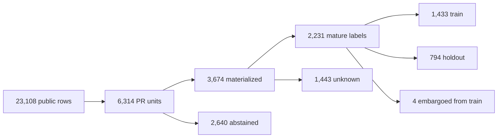

# Apache Airflow result: a useful null

## Outcome

RuleLoom's preregistered Horn learner found no rule satisfying minimum support
and `0.70` training precision. On the untouched chronological holdout it
therefore behaved like “never alert”: MCC `0.000`, precision `0.000`, recall
`0.000`, and alert rate `0.000`.

This fails the frozen success criterion. No candidate should enter shadow mode
or become agent guidance. A conservative source-continuity bug was found after
the first metrics were inspected, so every result below comes from a clean
corrected rerun and the invalidated attempt remains disclosed in
`correction-001.json`. The result validates a scalable, reproducible historical
pipeline; it does not validate predictive ILP for this target and vocabulary.

## Cohort flow

The 2,640 abstentions were explicit: 2,450 missing Git objects, 45 disagreements
between provider and exact Git path counts, 124 changes touching configured
exclusions, and 21 ineligible scopes. The aggregate extractor never invented
per-file churn or entropy and never substituted a later PR head for the opening
snapshot.

## Holdout comparison

| Model | MCC | Precision | Recall | Alert rate |
|---|---:|---:|---:|---:|
| RuleLoom Horn | 0.000 | 0.000 | 0.000 | 0.000 |
| Best train-selected literal | 0.081 | 0.217 | 0.074 | 0.029 |
| Size only | -0.013 | 0.080 | 0.235 | 0.253 |
| Boolean logistic | 0.136 | 0.159 | 0.397 | 0.214 |

The Horn result already loses to the preregistered single-literal baseline, so
the primary conclusion does not depend on the logistic comparison. The exact
logistic implementation was added after the first Horn result was inspected;
it is therefore reported as supplementary rather than confirmatory. Its weak
positive signal suggests that information is distributed across facts, but its
`0.159` precision is far below the frozen `0.70` operational threshold.

The reported `1.00` Horn bootstrap stability is stability of the empty rule
set. It is not evidence that a useful rule is stable.

## Source continuity correction

The first run checked only that the public table's latest timestamp passed the
collection cutoff. Release review added an exact source-wide hourly audit and
found 11,622 of 11,664 expected GH Archive hours: 42 were missing. A negative
now requires every hour that could contain a post-opening, pre-merge review to
be present. This reclassified 400 archive negatives as unknown; 134 of those
were in the materialized cohort. Observed positive review events were unchanged.

Because this conservative correction happened after first seeing metrics, it is
fully disclosed and the earlier candidate is invalid. The corrected result is
still a null and is suitable for engineering learning, but an independent
future interval or repository remains necessary for confirmation.

## Predicate audit

The materialized cohort contained 16 Boolean facts. Configured path concepts
covered 1,797 of 3,674 observations (`48.9%`); 1,877 observations activated only
shared change-shape facts. Three configured concepts were rare: clients (9
observations), database migrations (35), and Kubernetes runtime (29). No
configured drift warning or high-overlap relation crossed the frozen audit
thresholds.

This makes the null interpretable: the selected coarse path vocabulary is
stable enough to evaluate, but does not discriminate formal review requests at
the required precision. Refining it after seeing this result would create a new
exploratory experiment and require a new untouched confirmation window.

## Selection threat

Materialization retained 184 of 388 archive positives (`47.4%`) and 2,047 of
3,504 eligible negatives (`58.4%`). A two-class chi-square comparison gives
`17.266` with `p=0.0000325` and odds ratio `0.642`. Missing PR Git objects are therefore
not safely treated as random with respect to the known outcome.

Metrics apply only to the materialized cohort. They must not be generalized to
all Airflow PRs, and this retention difference is an additional reason not to
promote a policy.

## Engineering result

The original blob-filtered implementation performed a Git diff and lazy blob
fetch per PR; it was aborted after 470.54 seconds at unit 641 with zero
observations committed. The amended implementation:

- exports and audits the bounded public event window in about 6 seconds;
- imports 23,108 rows in about 16 seconds;
- fetches required public PR refs once, without checkout or code execution;
- validates repository identity and required objects once per cohort;
- obtains exact changed paths from Git trees while using complete opening-event
  aggregates only for total additions, deletions, and file count;
- completes the corrected 6,314-unit materialization in about 4.4 minutes;
- evaluates 100 Horn bootstrap runs in about 41 seconds using bitsets.

On this run, the partial observer clone used 166 MiB of Git objects, local
RuleLoom state used 51 MiB, and the raw event projection used 11 MiB. These are
environment-local measurements, not portable performance promises.

## What this changes

The next defensible experiment is not “try more clauses on the same holdout.” It
is one of:

1. pre-register a different target that is more directly tied to validation or
   defects;
2. define richer prediction-time concepts from outcome-blind architecture and
   ownership evidence, then confirm on a later untouched interval;
3. add relational entities such as component pairs or review ownership only
   through a new extractor and protocol, without reading outcome text; or
4. test the same fixed protocol on another public repository to measure
   portability.

The public artifacts make that decision auditable instead of hiding a failed
experiment.
