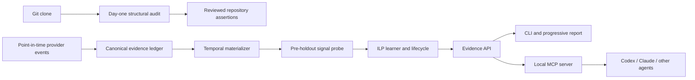

# RuleLoom adoption roadmap

RuleLoom's scientific core and its product surface are separate claims. A
chronologically evaluated Horn rule can still fail as a product if a team gets
no value on day one, must label every change manually, or cannot consult the
rule at the moment an agent decides what to edit.

This roadmap keeps the evidence model intact while making the common path
progressive and operational. It is intentionally independent of programming
language, repository layout, forge, and coding agent.

## Product position

RuleLoom is **evidence-backed guardrails for coding agents**: local-first memory
of recurring engineering risk that can show the evidence behind every rule and
retest whether the rule remains true.

That sentence does not imply that every historical pattern is a valid guardrail.
The UI and API must preserve these levels:

| Evidence level | Claim RuleLoom may make |
|---|---|
| Git audit | A structural or co-change pattern was observed. |
| Assertion audit | Repository history followed an explicit convention at an observed rate. |
| Chronological holdout | A frozen rule predicted a defined later outcome in future historical data. |
| Prospective shadow | The rule retained performance on newly observed changes. |
| Controlled rollout | Showing the rule may have changed an operational outcome. |

Never translate co-change into dependency, adherence into correctness,
prediction into causality, or MCP invocation into compliance.

## Delivery sequence

### v0.7: first-hour value and evidence supply

1. One outcome-blind audit command produces JSON plus a readable report from
   local Git evidence. It reports repository topology, change-size quantiles,
   hotspots, co-change, collection coverage, truncation, and limitations.
2. A strict repository-assertion manifest expresses an explicit antecedent and
   expected co-change. RuleLoom audits historical adherence and exceptions; it
   never interprets repository prose automatically.
3. A point-in-time GitHub capture path normalizes authorized webhook payloads
   into the immutable provider-neutral ledger. Replays are idempotent, conflicting
   provider IDs fail closed, and negative outcomes require a complete observable
   maturity condition.
4. The default audit output shows the selected range, truncation state, volume
   quantiles, hotspots, bounded co-change support, warnings, and limitations.
   The deterministic JSON adds complete limits, coverage, and manifest hashes;
   it does not invent a risk level or prescriptive next action from Git topology.
5. A local stdio MCP server exposes `assess_change`, `get_guidance`, and
   `explain_evidence` through the official Python SDK. Successful assessments
   receive durable, idempotent prediction IDs; shadow matches stay hidden.
6. Git audit analysis batches native `diff-tree` work, and topology ingestion
   accepts a fail-closed ancestor cursor for incremental observer runs.
7. Release automation builds from a version tag and publishes through PyPI
   Trusted Publishing. Publishing remains disabled until the project owner
   configures the matching PyPI project, GitHub environment, and trusted publisher.

Acceptance targets:

- no labels, LLM, forge account, or language-specific pack required for the
  first structural report;
- deterministic report manifest for identical normalized inputs;
- explicit bounds and visible incomplete-evidence warnings;
- no provider payload text executed as code or instructions;
- at least 70% of mature pilot units resolved automatically before claiming
  that automatic outcome supply is operational;
- a stratified manual audit of at least 100 automatically resolved outcomes,
  with the lower confidence bound for strong-positive precision at or above
  0.80 before marketing them as reliable labels.

### v0.8: operational validation and scalable storage

1. Agent skills explain when to consult MCP and record consultation coverage.
   The protocol cannot guarantee that an agent calls a tool, so a pilot must
   measure the eligible-change consultation rate.
2. A preregistered public case study compares RuleLoom with never/always alert,
   train-majority, size-only, best-single-predicate, and a simple statistical
   baseline on a chronological holdout. This gate is complete: the
   [Apache Airflow null result](../case-studies/apache-airflow/RESULTS.md) is
   published and no policy was promoted.
3. A versioned scalable ledger replaces the 64 MiB sorted-JSONL boundary only
   after migration, canonical-export, recovery, concurrency, and million-record
   gates pass. SQLite/WAL and segmented JSONL remain candidates; Parquet/DuckDB
   remain analytical exports rather than evidence authority.
4. Native Windows support replaces direct POSIX locking with a tested abstraction
   and adds Windows CI for locking, rename, crash recovery, and package smoke tests.
5. A GitHub App is considered only after the Action/local collector demonstrates
   a real need for durable multi-repository webhooks, organization installation,
   or centralized checks. A hosted App processes provider metadata and therefore
   must not be described as wholly local-first.

### v0.9: signal-aware protocol and historical predicates

1. A schema-v4 rolling-origin probe estimates whether the frozen vocabulary has
   useful pre-holdout signal before Horn can access the deployment holdout.
2. Null Horn results expose bounded train-only near-misses and rejection reasons
   without converting post-selection diagnostics into evidence.
3. Low-prevalence clauses use preregistered relative-to-base-rate and alert-rate
   gates; MCC, average precision, and risk/coverage remain visible.
4. `generic_changes@2` adds ordinal change shape, diffusion, prior hotspots,
   dormancy, missing co-change partners, and privacy-preserving ownership
   boundaries without language parsing.
5. Materialization reports retention by outcome class, while missing historical
   snapshots remain abstentions and prospective capture prevents recurrence.
6. A bounded structural smoke run now executes the same frozen protocol on
   Flask, ripgrep, and Express and records safe abstention with no labels. This
   supports only implementation portability; predictive portability still
   requires provider outcomes and each surviving rule still requires
   repository-local prospective confirmation.

### v0.10: vocabulary resolution and Git-native exploratory labels

1. Horn 0.6 searches with a beam over every eligible predicate, gates on Wilson
   lower-bound precision and cross-half temporal consistency, prunes on a
   chronological window, and calibrates near-misses with a label-permutation
   null. Schema v4 and older keep Horn 0.5 behaviour and hashes.
2. `history bootstrap-git` records exact revert trailers and a history horizon;
   a preregistered `outcomes.git_window_days` window yields weak, opt-in,
   non-confirmatory negatives so a Git-only cohort can exercise the probe and
   the learner before provider evidence arrives.
3. `generic_changes@3` adds cumulative ordinals, generated-artifact hints,
   owner-area counts, and reviewed instantiated `touches_*` and
   `missing_partner_*` predicates. `ruleloom predicates propose` drafts them
   outcome-blind from Git structure, together with co-change assertion drafts,
   and `ruleloom init --pack-config` freezes the reviewed result.
4. The outcome-blind audit names the missing partner behind each co-change
   omission and warns when a time-window feature cannot fire within the
   observed history or is dominated by its warm-up period.

None of this changes the evidence levels above: a proposed predicate is a
draft, a Git-window label is exploratory, and a learned clause still needs the
chronological holdout and a blinded prospective shadow.

## Adoption gates

The following are release claims, not aspirational metrics:

| Claim | Required evidence |
|---|---|
| “Useful on day one” | Four of five independent engineers can identify at least one actionable structural finding and correctly classify it as non-predictive in a timed usability test. |
| “Automatic evidence supply” | Coverage and audited-precision targets above, replay tests, conflict abstention, and a documented unknown rate. |
| “Integrated with coding agents” | End-to-end Codex and Claude runs, durable prediction IDs for every successful assessment, zero shadow disclosure, and at least 90% consultation coverage in the pilot. |
| “Predicts repository outcomes” | Frozen protocol, untouched chronological holdout, both classes, baseline comparison, uncertainty intervals, and complete exclusions. |
| “Improves engineering outcomes” | Randomized or preregistered staged advisory rollout; retrospective metrics are insufficient. |

## Research and platform basis

The feasibility of small correlated-change suggestions is supported by the
peer-reviewed [Rex deployment](https://www.usenix.org/conference/nsdi20/presentation/mehta),
but its suggestion-acceptance outcome is not independent defect ground truth.
The broader ILP basis, temporal-evaluation constraints, noisy-label literature,
AutoSpec, and ADVENT transfer limits are catalogued in
[RESEARCH.md](RESEARCH.md).

The integration design follows the official
[MCP 2026-07-28 specification](https://modelcontextprotocol.io/specification/2026-07-28),
GitHub's guidance for
[secure use of Actions](https://docs.github.com/en/actions/reference/security/secure-use),
and PyPI's recommendation for short-lived OIDC credentials through
[Trusted Publishing](https://docs.pypi.org/trusted-publishers/).
