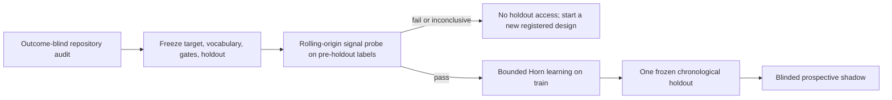

# Signal-first learning protocol

This protocol defines how RuleLoom decides whether a frozen repository
vocabulary contains enough signal to justify an ILP experiment. It protects the
chronological holdout from repeated vocabulary and target iteration.

The protocol is language-neutral. Facts describe change shape, path roles,
repository history, and ownership boundaries; they do not depend on a source
language parser. Repository-specific concepts remain configuration owned by the
repository using RuleLoom.

## Why this stage exists

A null result is informative, but repeatedly running Horn search against a
holdout while changing predicates turns the holdout into training data. Defect
prediction studies also show that validation choice, chronology, delayed labels,
class imbalance, and concept drift can materially change reported performance.

RuleLoom therefore uses this order:



The probe is a **signal-availability diagnostic**, not a theoretical ceiling.
Two predeclared model families are used because a logistic model alone can miss
simple interactions that a shallow tree can expose:

- class-balanced logistic regression over Boolean facts; and
- a class-balanced Boolean tree with maximum depth two by default.

Both are evaluated with expanding-window rolling-origin folds. At each fold,
training may use only labels whose `available_at` is no later than that fold's
validation start. Observations at or after the frozen
`evaluation.test_start_at` are excluded from the probe identity, metrics, and
model fitting.

## Frozen defaults

Schema v5 records these defaults in `.ruleloom/config.json` (schema v4 uses the same probe fields):

| Decision | Default |
| --- | ---: |
| Rolling-origin folds | 4 |
| Minimum initial train examples | 20 |
| Minimum validation examples per fold | 5 |
| Boolean-tree maximum depth | 2 |
| Probe predicate cap | 256 |
| MCC signal threshold | 0.25 |
| Conservative descriptive lift threshold | 3.0x |
| Minimum alert rate | 1% |
| Confidence level | 95% |

A model passes only when its alert rate meets the floor and either its MCC meets
the threshold or its conservative lift diagnostic meets the threshold. The
report also records average precision and selective risk. These gates are a
preregistered engineering decision, not universal constants from the papers.

The lift diagnostic divides the Wilson lower endpoint for alert precision by
the Wilson upper endpoint for cohort prevalence. It is deliberately labeled
`descriptive_not_a_formal_post_selection_lift_interval`: alerted observations
were selected by a fitted model, observations may be dependent, and the two
intervals do not constitute a formal confidence interval for a ratio. Brown,
Cai, and DasGupta support Wilson intervals over Wald intervals for binomial
proportions; they do not establish this ratio as post-selection inference.

Run the probe explicitly with:

```console
ruleloom signal-probe --json
```

`pass` permits the separately frozen ILP/holdout stage. `fail` means the current
pre-holdout facts did not clear the registered thresholds. `inconclusive` means
there were too few temporally eligible examples or classes. Neither result
licenses changing the current experiment and retrying on the same holdout.

## Horn gates and near-misses

Schema v4 defaults the Horn learner to relative gates because a selective
guardrail may be useful at low coverage even when its absolute precision is
below 0.70. A clause must satisfy:

- minimum newly covered positive support;
- positive utility after the registered false-positive and complexity costs;
- minimum alert rate; and
- the registered conservative lift diagnostic for the clause and the combined
  rule set.

MCC remains a whole-model evaluation measure. Risk/coverage is reported because
abstention is a first-class behavior, consistent with selective classification.

When no clause passes, RuleLoom stores the top rejected clauses with train-only
support, confusion counts, precision, lift diagnostic, rejection reasons, and
the number of hypotheses examined. Near-misses are explicitly
`train_only_exploratory`; searching many hypotheses creates selection bias, so
they are debugging evidence, never confirmatory claims or automatically relaxed
gates.

### Horn 0.6 search controls (schema v5)

Schema v5 freezes five additional train-only controls. Each addresses a
specific way the Horn 0.5 search could miss or overstate a rule:

| Control | Default | Problem it addresses |
| --- | --- | --- |
| `search_strategy: beam` with `beam_width: 20` and `max_predicates: 64` | on | Exhaustive enumeration over a marginal-ranked top-12 prefix discards predicates that matter only in conjunction; the beam refines bodies over every eligible predicate using a Laplace precision heuristic on newly covered positives. |
| `predicate_ranking: logistic_weight` | on | The prefix that enters the search is ordered by the magnitude of the train-only class-balanced logistic weight rather than the marginal rate gap. |
| `precision_estimate: wilson_lower` | on | Point precision lets a two-example clause pass an absolute 0.70 gate; the Wilson lower bound at the registered confidence gates and orders clauses instead. |
| `require_temporal_consistency` | on | A clause must cover at least one positive and beat the base rate in both chronological halves of the training window, otherwise it is rejected as `unstable_across_train_halves`. |
| `prune_fraction: 0.2` | on | Clauses are grown on the first 80% of the training window, literals are deleted while the RIPPER prune value on the last 20% does not decrease, every gate is re-evaluated on the complete window, and clauses that do not improve prune-window MCC are dropped. Pruning is skipped when either window lacks a class. |
| `permutation_runs: 100` | on | Labels are shuffled within four chronological blocks and the first-rule search is repeated; the report gives the best train statistic under the null, its quantiles, and `(1 + exceedances) / (runs + 1)`. This is a calibration of the near-miss table, not a hypothesis test. |
| `tree_seeds` | on | Root-to-leaf conjunctions of the probe's shallow tree whose leaf favours positives are evaluated as extra bodies under the same gates. |

All controls are disabled for schema v4 and older configurations, and a v5
configuration with the Horn 0.5 defaults reproduces Horn 0.5 exactly. Bootstrap
stability reruns reuse the same controls without the permutation null.

## Language-neutral historical facts

`generic_changes@2` adds deterministic ordinal and point-in-time predicates,
and `generic_changes@3` (schema v5) extends them with the last five rows:

| Predicate family | Meaning | Guardrail |
| --- | --- | --- |
| `churn_band_*` | Ordinal churn relative to frozen repository thresholds | No language parsing |
| `file_count_band_*` | Single/few/many/wide file count | No universal size cutoff claimed |
| `change_diffusion_*` | Normalized distribution of churn across files | Abstains when only aggregate statistics exist |
| `touches_recent_change_hotspot` | A changed path had at least three prior touches in 90 days | Prior observations only; timestamp disorder causes abstention |
| `touches_dormant_area` | A known path had not changed for more than 365 days | Left-censored; never treats unseen as dormant |
| `missing_usual_cochange_partner` | A path omitted a partner seen in at least five prior co-changes with confidence at least 0.70 | Exact path manifests only; current-path and cumulative pair budgets abstain |
| `crosses_codeowners_boundary` | Changed paths map to at least two distinct owner sets in the prior `CODEOWNERS` snapshot | Owners are counted but never persisted; unsupported syntax and excessive match work abstain |
| `churn_at_least_*` / `files_at_least_*` | Cumulative thresholds over the same frozen band boundaries | Lets one clause express a threshold instead of one exclusive band |
| `owner_areas_at_least_2` / `owner_areas_at_least_3` | Number of distinct owner sets touched in the prior `CODEOWNERS` snapshot | Same transient counting and abstention rules as the boundary fact |
| `touches_generated_artifact` | A changed path follows a documented generated-file naming convention or carries `linguist-generated` in the base `.gitattributes` | Naming conventions are heuristics; the attribute is the repository-declared signal |
| `touches_*` instantiated paths | Reviewed exact paths, owner-area globs, or pair endpoints frozen in `pack_config` | Proposed outcome-blind; activation needs human review and a new experiment |
| `missing_partner_*` | A reviewed `path` glob changed and no `partner` glob changed | One frozen pair per predicate; the relational pattern is instantiated, not learned |

The co-change predicate compresses relational history into a unary fact that
the bounded Horn learner can consume. It is an empirical coupling signal, not a
declared dependency. `CODEOWNERS` snapshots are read in bounded native Git batch
operations, so a backfill does not launch one Git process per commit.

RuleLoom does **not** currently turn `fix` keywords, SZZ blame links, or a
missing Git object into a strong predictor. SZZ studies report substantial
label error, and approximating a missing opening snapshot with a later merge
base can introduce outcome-caused files. Missing snapshots remain abstentions;
the materialization report instead shows retention separately for positive,
negative, and unknown derived outcomes. Weak SZZ/fix evidence remains an
explicit, non-confirmatory opt-in in the outcome layer.

## Outcomes, retention, and cold start

Git alone can now supply *exploratory* labels for `post_merge_revert_or_hotfix`.
`history bootstrap-git` records exact `git revert` trailers as weak positive
votes and a `git_history_horizon` proving how far the retained prefix reaches;
a schema-v5 `outcomes.git_window_days` window that closed before that horizon
with no revert vote is a weak negative. Both need `--include-weak`, are never
confirmatory, and miss fix-forward hotfixes, so use them to run the probe and
the learner while provider evidence is being connected, not as ground truth.

Prefer defect-oriented atomic targets such as `post_merge_defect` or
`post_merge_revert_or_hotfix` when the provider evidence can attribute them to a
change. Review-process targets remain valid experiments, but should be
stratified by component or workflow when a heterogeneous monorepo averages away
local signal.

Historical materialization reports, before Git-object filtering, how many
positive, negative, and unknown outcomes were eligible and how many were
retained. Different retention rates are a missing-data warning, not a correction
or causal estimate. A truncated or force-pushed history must not silently become
a clean negative cohort.

For new activity, capture the opening/synchronization snapshot and later
review/CI/revert/incident events continuously. This removes the need to recover
deleted PR heads later and makes label availability observable. Existing
Git-only and final-only history remains useful for audit and probe design but is
non-confirmatory.

Cross-project transfer is not enabled by default. Research shows it can reduce
cold-start degradation, but repository shift can also produce false alarms.
RuleLoom requires a future versioned transfer protocol with source-repository
provenance and a target-repository chronological confirmation window before
cross-project examples can influence a policy.

## Portability protocol

To distinguish “this target lacks signal here” from “the vocabulary lacks
portable signal,” run the same frozen schema-v5 protocol on at least three
repositories:

1. register one operationally identical atomic target and maturity rule;
2. freeze the same learner/probe gates before inspecting any outcome metrics;
3. report audit coverage, extraction abstentions, and retention by outcome;
4. run the signal probe without touching each holdout;
5. run Horn and the holdout only for repositories whose probe passes;
6. report every null result and near-miss without retuning it retroactively; and
7. confirm any surviving clause prospectively in its own repository.

Portability means the protocol is executable across repositories. It does not
mean a predicate or learned rule transfers semantically or predictively.

The first bounded execution of this protocol is published in the
[v0.9 portability smoke result](../case-studies/portability-v09/RESULTS.md).
Flask, ripgrep, and Express all materialized the language-neutral vocabulary and
all three stopped before learning because Git-only history contained no mature
labels. That is evidence of executable portability and safe abstention only.

## Research basis

- Kamei et al., [*A Large-Scale Empirical Study of Just-in-Time Quality
  Assurance*](https://das.encs.concordia.ca/pdf/Kamei_TSE2013.pdf), IEEE TSE
  2013: motivates change-level prediction and relative churn/history features.
- Falessi et al., [*On the Need of Preserving Order of Data When Validating
  Within-Project Defect Classifiers*](https://link.springer.com/article/10.1007/s10664-020-09868-x),
  EMSE 2020: supports forward-time validation rather than random folds.
- Tantithamthavorn et al., [*An Empirical Comparison of Model Validation
  Techniques for Defect Prediction Models*](https://sail.cs.queensu.ca/data/pdfs/TSE2016_AnEmpiricalComparisonofModelValidationTechniquesforDefectPredictionModels.pdf),
  IEEE TSE 2017: shows validation choice can create unstable or biased estimates.
- Song, Minku, and Yao, [*An Investigation of Online and Offline Learning Models
  for Online JIT Software Defect Prediction*](https://link.springer.com/article/10.1007/s10664-023-10335-6),
  EMSE 2023: motivates label-availability-aware sequential training and drift
  monitoring.
- McIntosh and Kamei, [*Are Fix-Inducing Changes a Moving
  Target?*](https://posl.ait.kyushu-u.ac.jp/~kamei/publications/McIntosh_TSE2017.pdf),
  IEEE TSE 2018: motivates chronological recency and prospective monitoring.
- Zimmermann et al., [*Mining Version Histories to Guide Software
  Changes*](https://www.cs.kent.edu/~jmaletic/cs63902/Papers/Zimmermann04.pdf),
  ICSE 2004: motivates prior co-change evidence while not making it a dependency.
- Bird et al., [*Don't Touch My Code! Examining the Effects of Ownership on
  Software Quality*](https://www.microsoft.com/en-us/research/uploads/prod/2016/02/bird2011dtm.pdf),
  ESEC/FSE 2011: motivates testing ownership-boundary facts, without assuming
  that `CODEOWNERS` is equivalent to contribution ownership.
- El-Yaniv and Wiener, [*On the Foundations of Noise-free Selective
  Classification*](https://jmlr.org/papers/v11/el-yaniv10a.html), JMLR 2010:
  motivates explicit risk/coverage reporting for an abstaining guardrail.
- Brown, Cai, and DasGupta, [*Interval Estimation for a Binomial
  Proportion*](https://projecteuclid.org/journals/statistical-science/volume-16/issue-2/Interval-Estimation-for-a-Binomial-Proportion/10.1214/ss/1009213286.pdf),
  Statistical Science 2001: supports Wilson rather than Wald proportion
  intervals.
- Liu, Zhang, and Wong, [*Controlling False Positives in Association Rule
  Mining*](https://www.vldb.org/pvldb/vol5/p145_guimeiliu_vldb2012.pdf), PVLDB
  2011: motivates multiple-testing warnings and an untouched holdout.
- Herbold et al., [*Problems with SZZ and
  Features*](https://link.springer.com/article/10.1007/s10664-021-10092-4),
  EMSE 2022: motivates weak evidence grades and abstention for noisy inferred
  defect labels.
- Tabassum et al., [*Cross-Project Online Just-In-Time Software Defect
  Prediction*](https://minkull.github.io/publications/TabassumTSE2022.pdf), IEEE
  TSE 2023: supports studying cross-project data for cold start, but does not
  establish unvalidated transfer as safe for RuleLoom.

These papers support the individual controls and feature families. None proves
that RuleLoom, ILP, or a particular repository rule improves agent behavior.
That remains the prospective product hypothesis.
